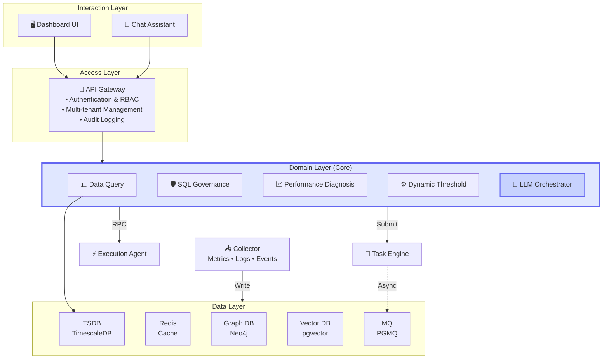

# 架构图生成提示词

## 英文提示词（推荐 - 适用于 DALL-E、Midjourney、Claude Artifacts）

```
A professional enterprise-level system architecture diagram of an AI-driven Database Intelligent Operations Platform (Database Intelligent Cockpit).

## Style
- Clean, modern, minimalistic design
- Inspired by Alibaba Cloud / ByteDance architecture diagrams
- Blue-purple gradient tech color palette
- Soft shadows, rounded rectangles, glassmorphism effect
- High readability, clear hierarchy, well-aligned layout
- Suitable for PPT presentation, high resolution

## Layout
- Top-down layered architecture
- 4 main horizontal layers
- Additional independent components placed beside layers (not as layers)
- Clear separation of control flow and data flow
- Balanced spacing, strong alignment

## Layers

### 1. Interaction Layer (Top Layer):
- Dashboard UI (monitor icon)
- Chat Assistant (chat bubble icon)
- Two components side by side in rounded rectangles

### 2. Access Layer:
- One large rounded rectangle spanning full width
- Title: "API Gateway"
- Internal features listed with icons:
  • Authentication & RBAC (shield icon)
  • Multi-tenant Management (users icon)
  • Audit Logging (document icon)
- Use gateway/door icon

### 3. Domain Layer (Core Layer, visually emphasized):
- Large container with 5 domain modules in grid layout
- Slightly larger container or glowing border to highlight as core
- Each domain as a modular block:
  - Data Query Domain (GraphQL/database icon)
  - SQL Governance Domain (shield/check icon)
  - Performance Diagnosis Domain (chart/speedometer icon)
  - Dynamic Threshold Domain (gauge/toggle icon)
  - LLM Orchestrator Domain (AI/brain icon) - Highlight as central intelligence
- Use different shades of blue-purple gradient

### 4. Data Layer (Bottom Layer):
- Five database icons horizontally arranged:
  - TimescaleDB (time-series DB icon) - labeled "TSDB"
  - Redis (cache icon)
  - Neo4j (graph DB icon) - labeled "Graph DB"
  - pgvector (vector DB icon) - labeled "Vector DB"
  - PGMQ (message queue icon) - labeled "MQ"

## Independent Components (NOT layers, placed beside layers)

### Collector (placed on left side of Data Layer):
- Metrics Collector
- Log Collector
- Event Collector
- ONLY connects to Data Layer (write path)
- Show one-way arrows: Collector → Data Layer
- Minimal connections, clean design

### Execution Agent (placed on right side of Domain Layer):
- Represents unified execution gateway
- SQL / API execution capability
- Icon: server/play icon

### Task Engine (placed next to Execution Agent, also right side):
- Represents async task management system
- Icon: gear/workflow icon

## Relationships & Flow

### Solid arrows (synchronous flow):
- UI → Access Layer → Domain Layer
- Domain Layer → Execution Agent (controlled execution calls)
- Domain Layer → Task Engine (task submission)

### Dashed arrows (asynchronous flow):
- Task Engine ↔ MQ (async processing)
- Execution Agent may consume tasks from Task Engine / MQ

### Data flow:
- Data Query Domain → Data Layer (query path)
- Collector → Data Layer (one-way write only)

### AI flow:
- Chat Assistant → LLM Orchestrator Domain → other Domains → Task Engine / Execution Agent

## Visual Emphasis
- Highlight Domain Layer as the core (slightly larger container or glowing border)
- Highlight LLM Orchestrator Domain as the central intelligence module (different color or glow)
- Place Execution Agent and Task Engine clearly outside Domain Layer (right side)
- Place Collector near Data Layer with minimal connections (left side)
- Use icons for AI, database, pipeline, monitoring
- Keep layout uncluttered and symmetric

## Overall Feel
- High-tech, cloud-native, AI-driven platform
- Clear boundaries between data, control, and execution
- Strong sense of modular design and system orchestration
- Enterprise-grade, production-ready architecture

## Output Format
- SVG or PNG format
- Resolution: 1920x1080 or higher
- Clean, professional, easy to understand
```

---

## 中文提示词

```
请生成一张企业级 AI 驱动的数据库智能运维平台架构图（Database Intelligent Cockpit）。

## 设计风格
- 简洁、现代、极简设计
- 参考 阿里云 / 字节跳动 架构图风格
- 蓝紫渐变科技配色
- 柔和阴影、圆角矩形、毛玻璃效果
- 高可读性、清晰层次、对齐布局
- 适合 PPT 演示，高分辨率

## 整体布局
- 自上而下的分层架构
- 4 个主要水平层
- 独立组件放置在层的侧面（不作为层）
- 清晰区分控制流和数据流
- 间距均衡，对齐整齐

## 分层结构

### 第一层：Interaction Layer（交互层，最顶层）
- Dashboard UI（仪表盘界面）- 显示器图标
- Chat Assistant（聊天助手）- 对话框图标
- 两个组件并排，用圆角矩形表示

### 第二层：Access Layer（访问层）
- 一个大的圆角矩形横跨整个宽度
- 标题为 "API Gateway"
- 内部列出功能：
  • Authentication & RBAC（认证授权）- 盾牌图标
  • Multi-tenant Management（多租户管理）- 用户图标
  • Audit Logging（审计日志）- 文档图标

### 第三层：Domain Layer（领域层，核心层，视觉强调）
- 大容器包含 5 个领域模块，采用网格布局
- 稍大的容器或发光边框突出核心地位
- 每个领域模块：
  - Data Query Domain（数据查询域）- GraphQL/数据库图标
  - SQL Governance Domain（SQL 治理域）- 盾牌/检查图标
  - Performance Diagnosis Domain（性能诊断域）- 图表/仪表图标
  - Dynamic Threshold Domain（动态阈值域）- 仪表/开关图标
  - LLM Orchestrator Domain（LLM 编排域）- AI/大脑图标 - 突出显示为中央智能
- 使用蓝紫渐变的不同深浅

### 第四层：Data Layer（数据层，最底层）
- 五个数据库图标横向排列：
  - TimescaleDB（时序数据库）- 标注 "TSDB"
  - Redis（缓存）
  - Neo4j（图数据库）- 标注 "Graph DB"
  - pgvector（向量数据库）- 标注 "Vector DB"
  - PGMQ（消息队列）- 标注 "MQ"

## 独立组件（不是层，放置在层的侧面）

### Collector（采集器，放置在数据层左侧）
- Metrics Collector（指标采集）
- Log Collector（日志采集）
- Event Collector（事件采集）
- 仅连接到数据层（写入路径）
- 显示单向箭头：Collector → Data Layer
- 最少连接，设计简洁

### Execution Agent（执行代理，放置在领域层右侧）
- 代表统一执行网关
- SQL / API 执行能力
- 图标：服务器/播放图标

### Task Engine（任务引擎，放置在执行代理旁边）
- 代表异步任务管理系统
- 图标：齿轮/工作流图标

## 关系与流程

### 实线箭头（同步流）
- UI → Access Layer → Domain Layer
- Domain Layer → Execution Agent（受控执行调用）
- Domain Layer → Task Engine（任务提交）

### 虚线箭头（异步流）
- Task Engine ↔ MQ（异步处理）
- Execution Agent 可从 Task Engine / MQ 消费任务

### 数据流
- Data Query Domain → Data Layer（查询路径）
- Collector → Data Layer（单向写入）

### AI 流
- Chat Assistant → LLM Orchestrator Domain → 其他 Domains → Task Engine / Execution Agent

## 视觉强调
- 突出 Domain Layer 为核心（稍大容器或发光边框）
- 突出 LLM Orchestrator Domain 为中央智能模块（不同颜色或发光）
- Execution Agent 和 Task Engine 清晰放置在 Domain Layer 外部（右侧）
- Collector 放置在 Data Layer 附近，最少连接（左侧）
- 使用 AI、数据库、管道、监控图标
- 布局整洁对称

## 整体感觉
- 高科技、云原生、AI 驱动平台
- 数据、控制、执行边界清晰
- 模块化设计和系统编排感强
- 企业级、生产就绪架构

## 输出格式
- SVG 或 PNG 格式
- 分辨率：1920x1080 或更高
- 清晰、专业、易于理解
```

---

## Mermaid 代码（用于 Draw.io、Notion、GitHub）



---

## 配色参考

| 用途 | 颜色代码 | 说明 |
|------|---------|------|
| 主色 | `#6366F1` | Indigo-500，蓝紫色主调 |
| 辅色 | `#8B5CF6` | Violet-500，紫色渐变 |
| 背景 | `#F8FAFC` | Slate-50，浅灰背景 |
| 强调 | `#10B981` | Emerald-500，成功/正向 |
| 核心 | `#E0E7FF` | Indigo-100，核心层高亮 |
| 边框 | `#64748B` | Slate-500，边框线条 |