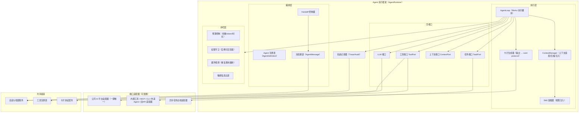
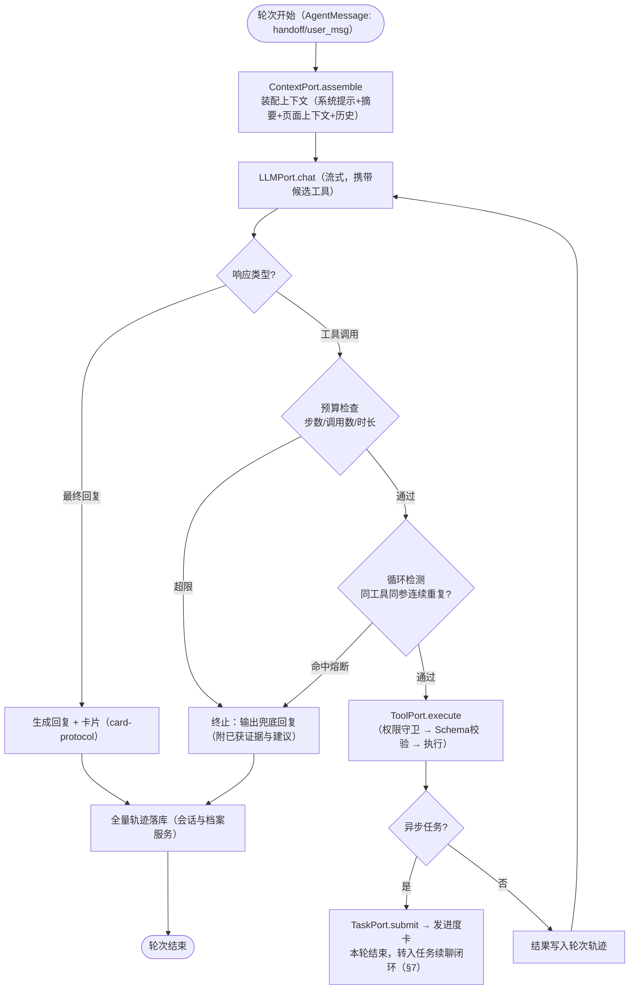
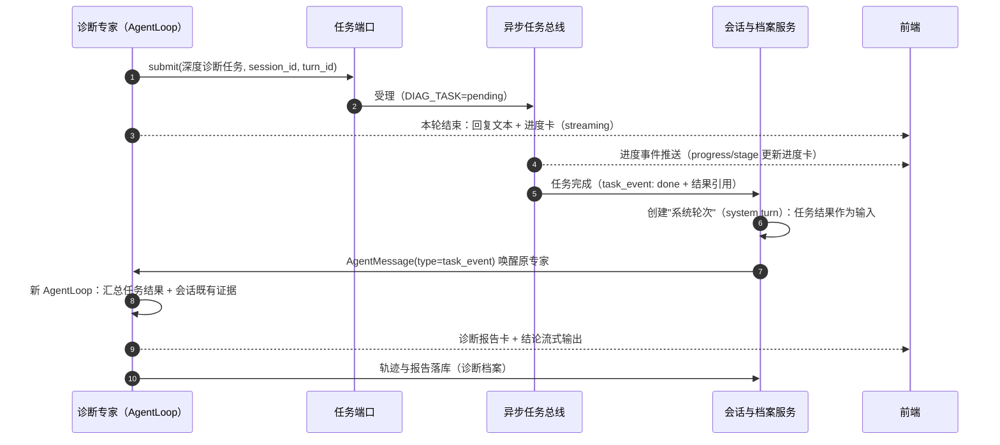

# Agent 执行框架 · 详细设计（最终版）

| 项 | 内容 |
|---|---|
| 文档版本 | v2.2 |
| 上游文档 | 《数据库AI智能运维平台架构设计文档》第 5 章；《统一工具注册表详细设计》；《Generative UI卡片协议详细设计》 |
| 定位 | AI 层核心运行时：承载路由/专家 Agent 的执行循环、端口适配、上下文管理、通信、护栏与可观测 |
| 状态 | 设计定稿 |
| 实现状态 | 运行时待 agentcluster（Python）落地——当前 apiserver 侧以 builtin 内置场景 + `agentcluster-mock/` 契约参考实现顶替；实现进度见 docs/ROADMAP.md |

> **变更记录**
> - v2.2（2026-08-22）：§15 边界契约表对齐 D35/D36/D15——配置与注册表改 **PG 直读**（拉取端点退役，补 tool_definitions）、任务改 **agent_tasks 表契约**（tasks API 与 wake 退役）。
> - v2.1（2026-08-22）：文档重组（docs/design/）——头部补实现状态。
> **变更记录**
> - v2.0（2026-08-21）：依赖规则重构——AgentDefinition 固定专家改为主 agent + 动态 SubagentDef 装配（管理面实体直读）；任务改 agent_tasks 表契约（wake 退役）；工具目标形态经 MCP Server（tools/data 过渡）。详见《Agent集群开发规格》v2.0。
> - v1.4（2026-08-21）：存储三域分治——CheckpointSaver/轨迹/计量/摘要改为 agentcluster **直连 PG 内核域**（表由 Go 统一建模、受限角色）；§14.1/§15/边界重申同步。详见《交互时序与生命周期》v1.3 D32-D34。
> - v1.3（2026-08-20）：数据面对齐——工具取数的直连类数据经 Go→remote 访问网关执行（Go · 平台侧 ×1 · 仅 SQL · Python 无感知，实例熔断时 Go 降级通道 c 兜底）；详见《交互时序与生命周期》§7/§8 与架构文档 §3.4.1。
> - v1.2（2026-08-20）：对话入口改为 `POST /internal/exec/turns` 执行流（Go 终结 SSE）；新增 §14.4 轮次状态机与恢复；§15 增补配置下发与 wake 幂等；§16 并入 MVP 必补清单（取消传播/心跳/幂等/注入防御基线/计量反馈等）。详见《交互时序与生命周期》。
> - v1.1（2026-08-16）：执行运行时确定为 Python + LangGraph；新增 §14 LangGraph 落地映射、§15 Go↔Python 边界契约、§16 MVP 实现约定与降级。
> - v1.0（2026-08-10）：初版最终稿。

---

## 1. 设计目标

1. **一套运行时，所有 Agent 复用**：路由 Agent 与各领域专家共用同一执行框架，新专家 = 新配置，不改框架代码；
2. **端口化**：Agent 逻辑仅依赖四个端口（LLM / 工具 / 上下文 / 任务），基础设施（公司 AI 平台、任务总线、存储）挂在端口之下，可替换；
3. **一套定义，两种承载**：同一 AgentDefinition 可挂为常驻推理服务，也可被任务总线拉起为 Worker；
4. **全程可审计可回放**：每一步推理、每一次工具调用、每一条 Agent 间消息落轨迹，支持故障回放与质量评估；
5. **有界执行**：步数、token、时长、费用全部有预算，任何 Agent 不可能无限循环或无限花钱。

## 2. 总体结构



## 3. Agent 定义模型（AgentDefinition）

Agent = 声明式配置，注册于 Agent 注册表，版本化管理、支持灰度：

```yaml
name: diagnosis_expert
display_name: 诊断专家
version: "1.0.0"
status: active                     # active / shadow / deprecated
role: expert                       # router / expert

# --- 模型配置（经 LLM 端口，不直连平台）---
model_profile:
  provider_ref: "corp-ai-platform" # 指向 AI 平台适配层注册的模型服务
  model: "corp-chat-pro"
  params: { temperature: 0.2 }
  fallback_model: "corp-chat-lite" # 超时/故障降级模型

# --- 提示词（版本化独立管理）---
system_prompt_ref: "prompts/diagnosis_expert/v3.md"

# --- 工具策略 ---
tools_policy:
  allow_categories: [metrics, session, lock, slow_sql, execution_plan, diagnosis, alert]
  deny_tools: []
  db_type_routing: true            # 按实例 db_type 过滤候选工具

# --- Skills ---
skills: [skill_lock_wait_triage, skill_slow_sql_analysis]

# --- 上下文策略 ---
context_strategy:
  max_context_tokens: 32000
  summary_threshold_turns: 8       # 超过后旧轮次滚动摘要
  page_context_injection: true     # 自动注入当前页面上下文

# --- 输出 ---
output_cards: [diagnosis_report, metric_chart, data_table, action_suggestion, issue_card]

# --- Handoff（仅 router 有分发目标；专家只能 report 回 router）---
handoff_targets: []

# --- 执行预算 ---
budget:
  max_steps: 20                    # ReAct 最大步数
  max_tool_calls: 30
  max_output_tokens: 8000
  turn_timeout_s: 300              # 单轮交互上限
```

路由 Agent 的 `handoff_targets: [diagnosis_expert, dataqa_expert]`，并额外持有**意图分类策略**（提示词 + 分发规则）。

## 4. AgentLoop：ReAct 执行循环

每一轮（turn）中专家 Agent 的执行循环：



**关键规则**：
1. 每次 LLM 响应只有两类出口：工具调用（继续循环）或最终回复（结束）；
2. 异步工具调用是**轮次终止事件**：提交任务后当前轮即结束（回复"已启动深度诊断"），不阻塞等待，完成后走任务续聊闭环；
3. 任何终止路径（正常/超预算/熔断/异常）都必须落轨迹、给用户可理解的兜底回复；
4. 流式输出贯穿全程：思考轨迹、token、卡片分事件推送（§9）。

## 5. 四端口定义（接口契约）

接口以语言无关伪代码描述，实现挂载于端口适配器。

### 5.1 LLM 端口

```
interface LLMPort:
  chat(request: LLMRequest) -> LLMResponse          # 同步
  chat_stream(request: LLMRequest) -> Stream<Event> # 流式：token / tool_call / done
  # LLMRequest: messages[], tools[](ToolSchema), model_profile, budget_hint
  # Event: {type: token|tool_call|usage|done, ...}
```
适配器职责：公司 AI 平台协议转换、超时重试、降级到 `fallback_model`、调用计量。

### 5.2 工具端口

```
interface ToolPort:
  resolve(agent: AgentDefinition, instance: Instance?) -> ToolDefinition[]
      # 按 tools_policy + db_type 路由 + 权限过滤候选工具
  execute(call: ToolCall) -> ToolResult
      # 流水线：权限守卫 → 输入Schema校验 → 路由到适配器 → 执行 → 输出Schema校验 → 审计
      # 同步工具返回结果；异步工具返回 {task_id}（轮次终止信号）
```
工具适配器五类：Builtin / MCP / CLI / VendorAgent / LegacyApi——全部经《统一工具注册表详细设计》归一。

### 5.3 上下文端口

```
interface ContextPort:
  assemble(session: Session, agent: AgentDefinition) -> Context
      # 按预算装配：系统提示 + 历史摘要 + 近N轮原文 + 页面上下文 + 命中Skill正文
  summarize(turns: Turn[]) -> Summary
      # 滚动摘要压缩（仿主流Agent实践）
  inject_page_context(session, page_context) -> void
      # 页面上下文：实例ID/集群/时间窗/当前面板/选中元素
```

### 5.4 任务端口

```
interface TaskPort:
  submit(spec: TaskSpec) -> task_id        # TaskSpec: tool_name, input, session_id, turn_id
  cancel(task_id) -> bool
  on_event(handler: (TaskEvent) -> void)   # 订阅任务总线事件，驱动续聊闭环
```

## 6. 上下文管理（ContextManager）

上下文窗口按**预算制**装配，总预算来自 `context_strategy.max_context_tokens`：

| 分区 | 内容 | 压缩策略 |
|---|---|---|
| 系统区 | 系统提示词 + 角色规范 + 输出卡片协议说明 | 不压缩 |
| 摘要区 | 旧轮次滚动摘要（`context_summary`） | 超过 `summary_threshold_turns` 后，最旧轮次转摘要 |
| 现场区 | 最近 N 轮原文 + 当前用户消息 | 原文保留，N 随预算自适应收缩 |
| 页面区 | 当前页面上下文快照 | 每轮刷新，只保留最新一份 |
| 技能区 | 命中的 Skill 正文 | 按意图匹配按需注入，未命中不占窗口 |
| 工具区 | 候选工具 Schema | 超预算时按 category 相关性裁剪（保留 description 精简版） |

**摘要规则**：摘要必须保留——实例上下文、已确认的事实（如"CPU 正常"）、已排除的方向、未完成的线索；禁止丢失会改变后续推理方向的结论。

## 7. 任务续聊闭环（异步诊断的完整生命周期）



要点：**任务完成不是直接弹结果，而是唤醒专家做"二次推理"**——把外采报告与会话中已采集的本地证据交叉验证后出结论，这是对话式诊断区别于"调一次诊断接口"的价值所在。

## 8. Handoff 与 Agent 间通信

通信介质为 `AgentMessage`（协议见架构文档 5.6.1），执行框架内的落地规则：

| 环节 | 机制 |
|---|---|
| 分发（handoff） | Handoff 控制器校验目标 Agent 存在且 active → 组装 `context_pack`（不传完整对话）→ 目标专家开新 AgentLoop |
| 回报（report） | 专家最终回复同时携带结构化摘要（`report_summary`），供路由 Agent 跨专家汇总 |
| 唤醒（task_event） | 任务总线事件 → 会话服务创建系统轮次 → 定向唤醒绑定专家 |
| 并发约束 | 同一 session 同一时刻仅一个活跃 AgentLoop，避免并发写轮次；跨专家协作（二期）经路由 Agent 串行中转 |
| 失败处理 | handoff 目标不可用 → 路由 Agent 降级自答并声明能力受限，不静默失败 |

## 9. 流式输出协议（前端 SSE）

单轮对话一条 SSE 通道，事件类型：

| event | payload | 渲染 |
|---|---|---|
| `thought` | {step, tool_name, status} | 可折叠推理轨迹（过程透明化） |
| `token` | {text_delta} | 流式文本追加 |
| `card` | {card JSON（信封完整）, mode: create\|update} | 卡片渲染器注册表接管；update 按 card_id 幂等合并（进度卡高频更新） |
| `progress` | {task_id, progress, stage} | 定向更新对应进度卡 |
| `done` | {turn_id, usage} | 轮次收尾 |
| `error` | {code, message, fallback_text} | 降级提示，保留已产出内容 |

约定：卡片只在 `status=streaming` 期间允许 update；`final` 后只读。断线重连按 `last_event_id` 从轨迹补发。

## 10. 护栏与预算

| 护栏 | 机制 | 触发动作 |
|---|---|---|
| 步数预算 | `max_steps` / `max_tool_calls` | 终止循环，输出"已获证据 + 建议继续方向"的兜底回复 |
| 时长预算 | `turn_timeout_s` | 中断 LLM/工具等待，同上 |
| Token 预算 | 输出上限 + 上下文预算 | 截断 + 触发摘要压缩 |
| 循环检测 | 同工具同参数连续 ≥3 次，或步数内无新增证据 | 熔断，提示模型换路径或直接结论 |
| 权限守卫 | 工具执行前校验实例可见范围（权限网关签发凭证） | 拒绝执行，轨迹记录越权尝试 |
| 敏感过滤 | 入模型前与出卡片前双向过滤（SQL 字面量、连接串、口令） | 替换为占位符，审计原文不出域 |
| 工具失败 | 按 ToolDefinition.retry 重试；仍失败 | 错误注入上下文交由模型决策（换工具/降级结论），不崩溃 |
| 模型降级 | LLM 调用超时/故障 | 切 `fallback_model`；再失败 → 轮次错误事件，保留已产出 |

## 11. 可观测与质量

**轨迹模型（Trace）**：`session → turn → agent_step → tool_call / llm_call`，每层带耗时、token 用量、状态；AgentMessage 全部挂接到对应 turn。

**核心指标**：

| 指标 | 用途 |
|---|---|
| 首 token 时延 / 单轮时延 P95 | 体验 |
| 轮次成功率、兜底终止率 | 质量 |
| 工具调用成功率、参数校验失败率（LLM 误调用率） | 工具 description 质量评估 |
| handoff 准确率（抽样人工标注） | 路由质量 |
| 单轮成本（token × 单价） | 预算治理 |
| 预算超限率、循环熔断率 | AgentDefinition 调参依据 |

**回放能力**：任一 session 可从轨迹完整重放（输入、每步 LLM 响应、工具出入参），用于故障复盘与提示词回归测试。

## 12. 部署形态

同一运行时镜像，两种入口：

| 形态 | 入口 | 承载负载 | 部署 |
|---|---|---|---|
| 常驻推理服务 | HTTP/SSE 对话接口 + AgentMessage 消费 | 交互式轮次、任务续聊唤醒 | 一期主力：无状态 ≥2 副本，按并发会话水平扩展 |
| Worker | `task_id` 驱动入口 | 二期批量任务（巡检批处理/报告生成） | 任务总线拉起，跑完即销，可缩容到零 |

配置管理：AgentDefinition / 提示词 / Skill 全部版本化存储，支持热加载与 `shadow` 灰度（新旧 Agent 双跑比对输出后切流）。

## 13. 与其他契约的边界

| 边界 | 关系 |
|---|---|
| 工具注册表 | 执行框架只读消费 ToolDefinition，不持有工具实现；工具增删与框架发布解耦 |
| 卡片协议 | 卡片生成器按契约输出，前端按契约渲染，双方不依赖框架内部结构 |
| 会话与档案服务 | 框架通过其 API 读写会话/轨迹/档案，不直连存储（上下文隔离规则） |
| 任务总线 | 仅经任务端口交互；总线不感知 Agent 语义 |
| 权限网关 | 工具凭证由网关签发，框架不自行鉴权 |

## 14. LangGraph 落地映射（v1.1）

执行框架以 **LangGraph 为底座**实现。原则：**概念定义以本文档为准，LangGraph 只是承载**——四端口契约、护栏语义、轨迹模型不因框架而弱化。

### 14.1 概念映射表

| 本框架概念 | LangGraph 原语 | 落地说明 |
|---|---|---|
| AgentLoop（ReAct 循环，§4） | `StateGraph`：`agent → tools → agent` 循环 | 专家 = 一个编译后的 graph；tools 节点内实现 ToolPort 流水线（权限→校验→执行→审计） |
| AgentDefinition（§3） | 自定义加载器：YAML → graph 编译 | name / model_profile / tools_policy / skills / budget 全部从 AgentDefinition 注入，不散落代码 |
| LLM 端口（§5.1） | `init_chat_model`（OpenAI 兼容 base_url） | 原生 tool calling + 流式；`fallback_model` 降级在端口适配器内处理 |
| 工具端口（§5.2） | tools 节点（定制 ToolNode） | 执行前后挂输入/输出 Schema 校验、限流、审计；候选工具解析按 `tools_policy + db_type` 过滤 |
| 上下文端口（§5.3/§6） | 自定义 CheckpointSaver + ContextManager | CheckpointSaver **直连 PG 落 agent_checkpoints**（v1.4 内核域直写，表由 Go 统一建模）；ContextManager 装配/压缩自实现（直读 chat_* 呈现域 + agent_context_summaries） |
| 任务端口（§5.4） | 自定义（v2.0/D35）：直接写 PG `agent_tasks`（INSERT pending → FOR UPDATE SKIP LOCKED 认领 + 租约 → 推进度/置终态）；唤醒 = Go 轮询检出 done 后经 exec 流发起 `system_resume` 轮（kind/resume_of）→ graph 续跑 | 任务续聊闭环（§7）以"中断—唤醒续跑"语义实现；~~tasks API 与 wake 回调~~ 退役 |
| 异步工具=轮次终止（§4 规则2） | tools 节点返回 task_id 后 graph END，等待 wake 续跑 | 续跑时任务结果作为 system 输入注入（§7 时序不变） |
| 预算护栏（§10） | `recursion_limit` + 节点内自定义 guard | 步数/工具调用数/时长/token 检查与触发动作仍按 §10 表执行 |
| 循环检测（§10） | tools 节点内自定义（同工具同参连续 ≥3 次熔断） | |
| 流式输出（§9） | `graph.astream_events` → SSE 六类事件转换 | 事件经 `POST /internal/exec/turns` 执行流回传 Go 会话总线后转发前端（v1.2，Go 终结 SSE）；见 14.2 |
| Handoff（§8） | 路由 Agent = supervisor graph；handoff = 以 `context_pack` 初始化目标专家 graph（同 thread 续跑） | 专家不可点对点，全部经路由中转（§8 约束不变） |
| shadow 灰度（§12） | 同一定义编译两个版本 graph（不同提示词/模型）双跑比对 | |
| 热加载（§12） | 监听 AgentDefinition 配置变更 → 重建 graph；进行中轮次跑完旧版本 | |

### 14.2 流式事件转换

| LangGraph 事件 | 本框架 SSE 事件（§9） |
|---|---|
| `on_chat_model_stream`（token 增量） | `token` |
| `on_tool_start` / `on_tool_end` | `thought`（status: running / success / failed） |
| 卡片生成器 emit（自定义节点/回调） | `card`（create / update，按 card_id 幂等合并） |
| Go 任务回调透传 | `progress`（task_id / progress / stage） |
| graph END | `done`（turn_id + usage 汇总） |
| 异常 / 预算终止 / 熔断 | `error`（code / message / fallback_text，保留已产出内容） |

### 14.3 AgentDefinition 加载器

YAML（版本化存储于 agentcluster 配置目录，随轨迹留痕版本号）→ 解析校验 → 绑定 model_profile / 工具集 / skills / budget → 编译 StateGraph → 注册进程内 Agent 注册表。加载失败 = 该 Agent 标记 unavailable（handoff 降级自答，§8），不影响其他 Agent。

**配置绑定来源（v2.0）**：model_profile / 工具集 / skills / SubagentDef / WorkflowDef 一律**直读 PG 管理面表**（依赖规则②；配置拉取 API 已退役），缓存 + config_version 校验；启动全量 + 周期校验版本。变更**轮次边界生效**：进行中轮次跑完旧版本，新轮次开始快照 `config_version` 到 `chat_turns`（可复现、可回放）。

### 14.4 轮次状态机与恢复（v1.2 新增）

`chat_turns.status`：`running → done | failed | interrupted | cancelled`。完整状态机与恢复时序见《交互时序与生命周期》§3。

| 语义 | 约定 |
|---|---|
| done | 正常收尾（含 async 提交收尾：回复文本 + 进度卡） |
| failed | 崩溃/超预算/熔断——**MVP 行为**：保留已产出内容 + 兜底回复（error 事件） |
| interrupted | 崩溃可恢复（checkpoint 在），二期支持从 checkpoint 续跑（`exec/turns {resume_of}`） |
| cancelled | 用户取消：Go 中断执行流并级联取消 cancellable 任务 |
| 唤醒续跑 | wake 创建**新 system 轮次**（`resume_of` 指向 task_id），不复活旧轮次（§7 时序不变） |
| 并发仲裁 | 同 session 新轮次提交时，旧 running 轮次被取消（Go 侧仲裁） |
| 幂等 | turn 提交携带 `client_request_id`，Go 侧去重防前端重试双发 |

## 15. Go ↔ Python 边界契约（v1.1）

契约总纲见架构文档 §3.5，本节为运行时视角的执行约定：

| 交互 | 方向 | 契约与约定 |
|---|---|---|
| 对话入口 | FE → Go → Python | Go 收口并**终结** `/api/chat/...` 的 SSE（会话级常开 + 15s 心跳）；对 Python 经 `POST /internal/exec/turns` 建立上游执行流，六类事件（§9）进入 Go 会话总线后转发，Go 不解析卡片内容；任务 `progress` 事件由 Go 总线直发（不经 Python）。v1.2 起替代「透明反代」，详见《交互时序与生命周期》 |
| 工具取数 | Python → Go | `POST /internal/tools/data`：{tool_name, input} → 标准化输出；output_schema 校验在 Go 侧完成后返回，Python 侧不再校验；直连类数据经 Go→remote 访问网关执行（仅 SQL · Python 无感知，实例熔断时 Go 降级通道 c 兜底） |
| 会话/轨迹/checkpoint | Python ↔ PG | **直连（受限角色，v1.4）**：上下文直读 chat_*（只读）+ 内核域直写 tool_calls / llm_calls / agent_checkpoints / agent_context_summaries；取代原内部读写端点组 |
| 配置/注册表（v2.0） | Python ↔ PG | **直读管理面表（D36 + D15）**：model_configs / mcp_server_configs / skill_configs / subagent_defs / workflow_defs / **tool_definitions**（active 且 health=ok）；缓存 + config_version 校验，轮次边界生效（进行中轮次跑完旧版本，快照留痕 chat_turns） |
| 任务（v2.0，已退役 API） | Python ↔ PG | **agent_tasks 表契约（D35）**：agent 直写（INSERT pending / FOR UPDATE SKIP LOCKED 认领 / 租约 / 推进度），Go 只读轮询 + 限列写 notified/cancel_requested；~~`POST /internal/tasks`、`GET /internal/tasks/:id`、`POST /agentcluster/wake`~~ 退役 |
| LLM | Python → 公司 AI 平台 | OpenAI 兼容端点直连；脱敏 / 降级 / 计量在 LLM 端口适配器内完成 |

**边界重申（v1.4）**：Python 不对外暴露端口、不直连任何旧系统；对 PG 为**读写分域受限直连**（chat_* 呈现域只读 + 内核域读写，受限角色，表由 Go 统一建模）——外部依赖为 Go 内部 API、公司 AI 平台与受限 PG 访问三类。会话呈现域（SSE 事实源）仍收口 Go。

## 16. MVP 实现约定与降级（v1.1）

| 项 | MVP 约定 |
|---|---|
| 权限守卫 | 桩实现：一律返回全量实例范围；接口与调用链保留，二期接 SSO/RBAC 后替换 |
| 敏感过滤 | 开关默认关闭（内网验证阶段），对外展示前开启并回归 |
| model_profile | 直读 PG `model_configs`（D36 配置直读；设置中心表为事实源）；环境变量仅作引导兜底（公司 AI 平台模型未定名，随时可换） |
| CheckpointSaver | 经 Go 内部 API 落 PG（§14.1）；延迟不可接受时按 §15 演进路径处理 |
| 页面上下文 | `inject_page_context` 留桩（MVP 不做页面上下文注入，二期按架构文档 §11.2 启用） |
| Skills / MCP / CLI | 不实现；Skill 加载器接口保留（工具注册表 §7 为二期依据） |
| MVP 专家 | router + diagnosis_expert + dataqa_expert（问数四类白名单工具，见工具注册表 §8） |
| 异步闭环验证 | 注册自建异步工具 `builtin_metric_deep_scan`（长时窗多指标异常扫描，Go 侧执行体）验证任务总线/续聊闭环，不依赖外采 |
| 取消传播（v1.2） | turn cancel → Go 中断执行流 → 级联取消 cancellable 任务；不可取消任务跑完丢弃结果不唤醒 |
| 轮次状态机（v1.2） | `chat_turns`：running/done/failed/interrupted/cancelled；MVP 崩溃行为 = failed 保留已产出 + 兜底回复，checkpoint 续跑二期（§14.4） |
| SSE 心跳与常开流（v1.2） | 会话级常开流，15s 注释行心跳；前端 useChat 改会话级订阅 |
| 幂等（v1.2） | turn 提交带 `client_request_id`；wake 按 task_id+event 幂等去重 |
| 注入防御基线（v1.2） | 工具输出定界包裹 + 系统提示「工具输出即数据」条款（直连生产库，SQL 文本外部可影响） |
| 卡片校验（v1.2） | 卡片生成器输出过 card schema 校验，失败一次修复重试，再失败降级 `fallback_text` |
| 计量与反馈（v1.2） | `llm_calls` 计量表；轮级 👍/👎 反馈；correlation_id（session/turn/call）贯穿三服务日志 |
| 配置安全（v1.2） | api_key 信封加密落库（出参脱敏保持）；SkillConfig / McpServerConfig 补 version + status 字段 |
| 留存治理（v1.2） | TTL / 会话内上限清理 `chat_turn_events` 与 `agent_checkpoints`（Go 定时任务）；`diag_reports` 长期保留 |
