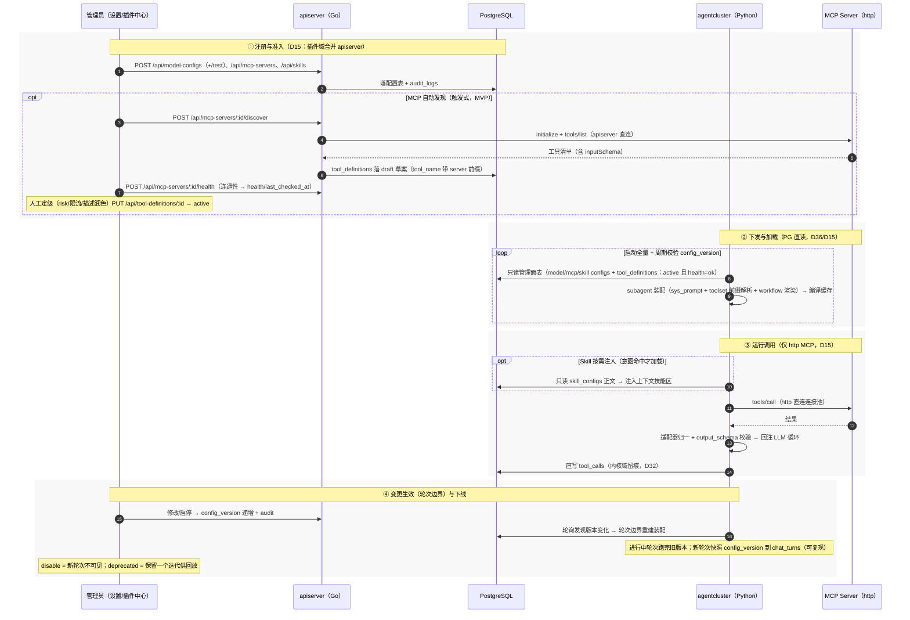
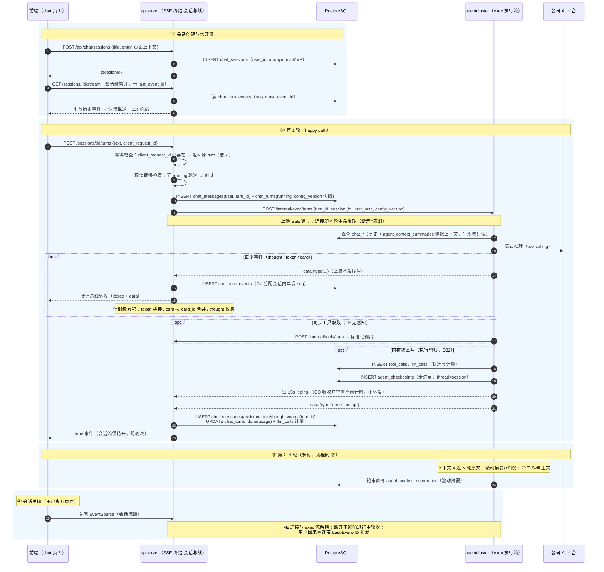
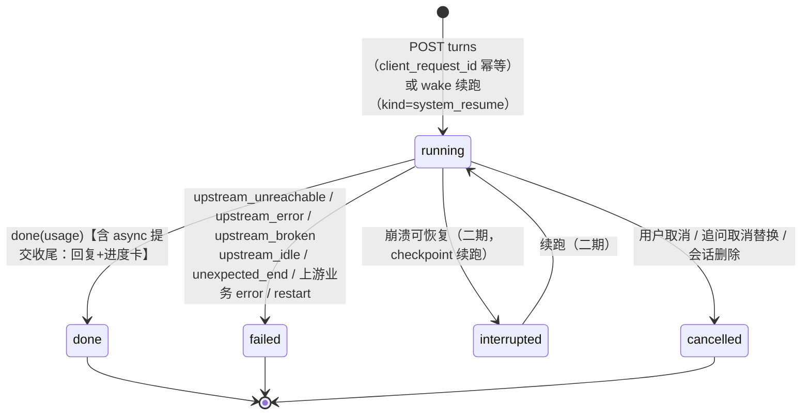
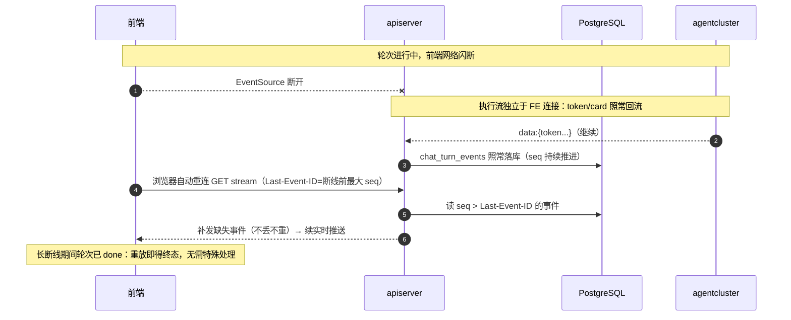
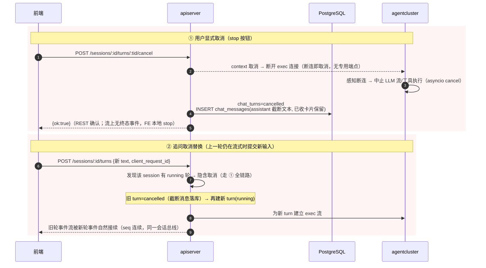
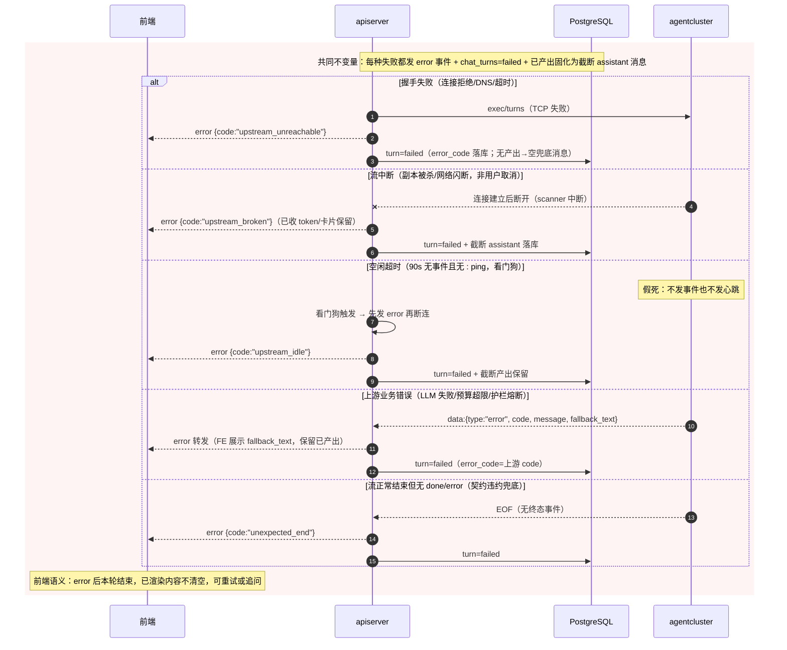
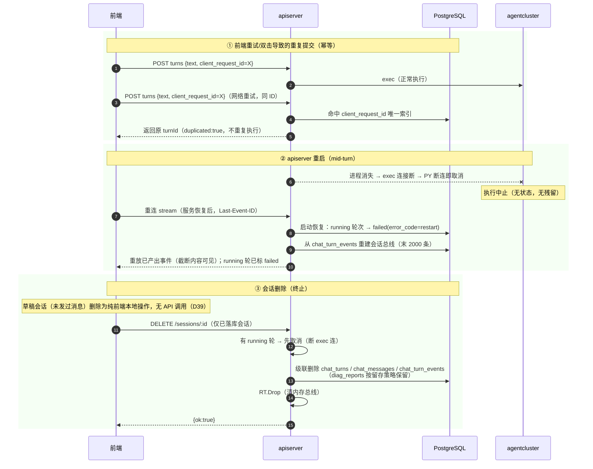
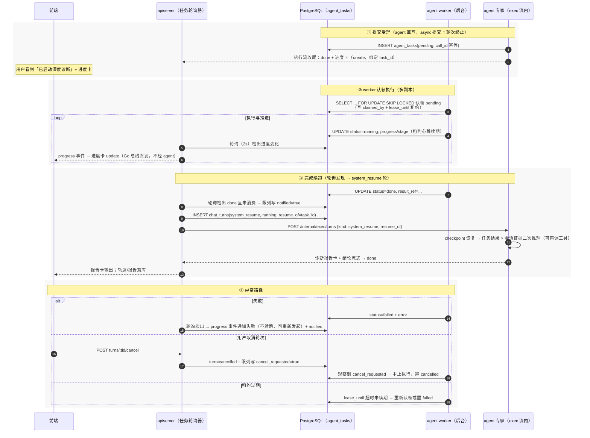
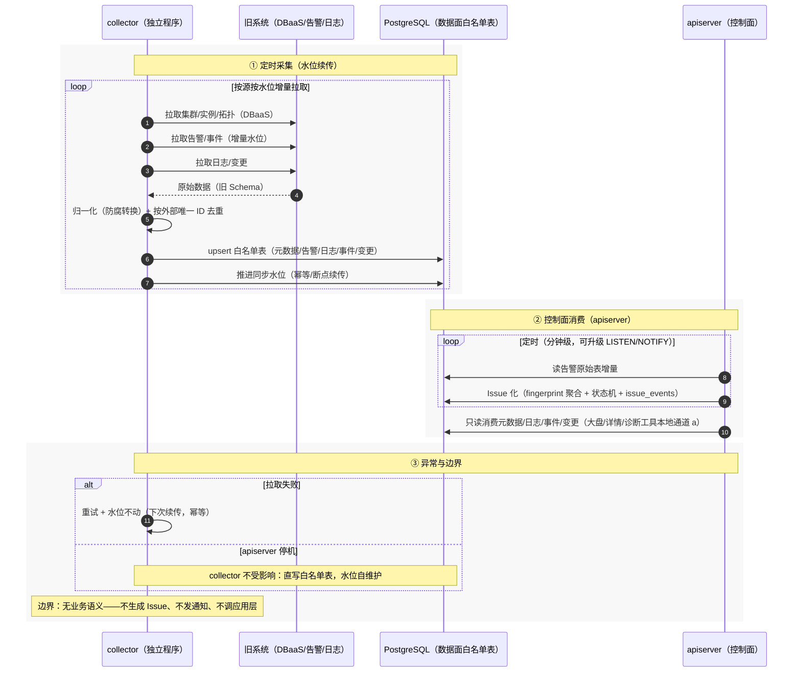
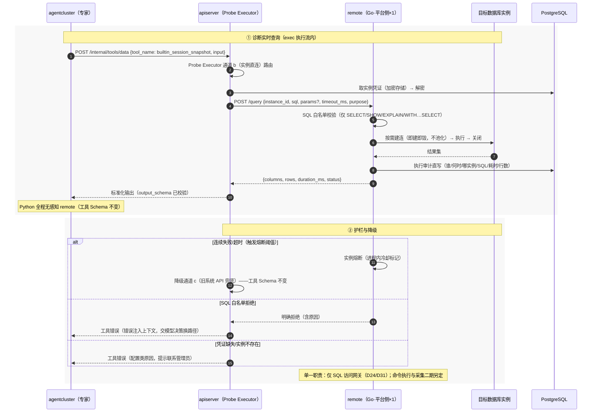

# 交互时序与生命周期 · 设计定稿

| 项 | 内容 |
|---|---|
| 文档版本 | v2.3 |
| 日期 | 2026-08-22 |
| 状态 | 已评审（依赖规则重构定稿） |
| 上游文档 | 《数据库AI智能运维平台架构设计文档》《Agent执行框架详细设计》《统一工具注册表详细设计》 |
| 实现状态 | §2-§5（chat / 插件配置 / 任务 / 内部契约）**已实现**（apiserver + agentcluster-mock 联调；§2 MCP 发现/定级流程为 D15 新设计待实施）；§6 collector / §7 remote / §8 数据面契约中两组件**设计态未实现**（白名单表结构已定稿，见 §8.2） |

> **变更记录**
> - v2.3（2026-08-22）：§2 插件生命周期时序对齐 **D15（插件域合并 apiserver）**——发现改为 apiserver 直连 `tools/list`（Go→Python discover 回写退役）、配置/注册表/Skill 改 **PG 直读**（拉取端点退役）、trace 留痕改内核域直写、仅 http MCP；要点 4 条更新。
> - v2.2（2026-08-22）：文档重组——头部补实现状态；D19/§6/§8.2 白名单表「待定」更新为**定稿进展**（元数据 4 表 + 告警/变更/慢日志/水位落地，lock 不建表）；六类表逐类标注实现状态。
> - v2.1（2026-08-21）：**惰性会话创建（D39）**——前端「新建会话」改为纯本地草稿（零后端写入），首条消息发送时才 `POST /api/chat/sessions` 完成服务端初始化（草稿转正换 id）；§3.1 图 A ①②重画、§3.3 图 F 补草稿删除注记；代码已同步（frontend useChat/chatSessions/types）。
> - v2.0（2026-08-21）：**依赖规则重构**——四条依赖通道定稿（①唯一 exec 调用含 auth_context / ②PG 表契约 / ③能力经 MCP / ④权限注入）；任务改为 agent_tasks 表契约（§4 重画，tasks API 与 wake 退役）；配置改直读 PG（拉取 API 退役）；固定专家改为主 agent + 动态 subagent（D35-D38）；事件信封加 agent 字段。代码已同步实现（taskbus/管理面 CRUD/限列写）。
> - v1.3（2026-08-21）：存储收口修订为**三域分治**——agentcluster 直连 PG（读写分域：上下文直读呈现域表 + 内核域直写 trace/计量/checkpoint/摘要；Go 统一建模建表；受限角色）。§3.1 箭头 12 改直查、留痕改直写；§5 端点表删会话轨迹组、补 PG 直连行；不变量增至七条；§0 补 D32-D34。
> - v1.2（2026-08-21）：§3 扩充为 **chat 全生命周期完整版**（主链路 + 断线重连 + 取消/取消替换 + 上游故障五分支 + 幂等/重启/删除 + 轮次状态机 + 错误码表 + 六条不变量）；新增 §5.1 exec 执行流契约详规（请求字段/六类事件信封/心跳与空闲判定/断连即取消/取消替换）；配套 `contracts/api/exec-turns-*` 金样。
> - v1.1（2026-08-20）：新增数据面两组件——collector（既有独立程序，元信息收集直写白名单表）与 remote（Go，平台侧 ×1，仅 SQL 的实例访问网关）：§0 补 D18-D31 决策；新增 §6 collector 采集生命周期、§7 remote 实时访问时序、§8 数据面契约；三收口修订为控制面/数据面分层。
> - v1.0（2026-08-20）：依据架构评审结论定稿——SSE 边界改为 Go 终结点模型、会话级常开流、工具注册表入库、轮次边界配置生效、wake 幂等语义、取消级联、TTL 留存；含对标市面 Agent 机制的缺口分析与三组生命周期时序图（插件/会话/任务）。

---

## 0. 背景与核心决策

前置评审确认：原「`/api/chat/*` 整组透明反代」模型下，异步任务进度推送、断线重放、并发轮次仲裁、shadow 双跑均**没有执行点**。本文档以 **Go 终结 SSE + Python 内部执行流** 为基线，给出三组生命周期时序图与缺口清单，作为 agentcluster（Python 侧）开发与 apiserver（Go 侧）改造的合同。

### 0.1 决策记录（评审定案，17 项）

| # | 决策点 | 结论 |
|---|---|---|
| D1 | SSE 边界模型 | **Go 终结 SSE**：复用 builtin Runtime 会话总线（单调 seq / `chat_turn_events` 落库 / `last_event_id` 重放）；Python 暴露 `POST /internal/exec/turns`（SSE）；`AGENT_MODE` 由「整组路由切换」改为「事件源切换」，上游不可用逐会话回退 builtin |
| D2 | 前端流模型 | **会话级常开 SSE**：跨轮次不断开，重连靠 `last_event_id` 重放；15s 注释行心跳（`: ping`）防代理缓冲与半开连接 |
| D3 | 工具注册表归属 | **ToolDefinition 入库**（Go PG `tool_definitions` 表 + 管理 API），agentcluster 拉取后编译 graph；「注册表是数据不是代码」 |
| D4 | MCP 连接持有方 | **agentcluster（Python）直连持有**（stdio 由 Python 副本拉起、http 直连、进程内连接池）；Go 只下发配置与收审计；独立 MCP 网关为二期演进 |
| D5 | 配置变更生效 | **轮次边界生效**：进行中轮次跑完旧版本；新轮次快照 `config_version` 到 `chat_turns`（可复现、可回放） |
| D6 | mid-turn 恢复 | turn 状态机含 `interrupted`；**MVP 实现 failed 行为**（保留已产出 + 兜底回复），checkpoint 续跑二期开 |
| D7 | wake 可靠性 | **至少一次投递 + Python 按 task_id+event 幂等去重** + Go 有限重试，表状态对账兜底 |
| D8 | 取消级联 | 用户取消轮次 → 中断执行流 + **级联取消**关联 running 任务（仅 `cancellable=true`）；不可取消任务跑完丢弃结果不唤醒 |
| D9 | 留存清理 | Go 定时任务：`chat_turn_events` / `agent_checkpoints` 按 TTL + 会话内上限；`diag_reports` 长期保留；MVP 即带最简 TTL 任务 |
| D10 | 缺口分析范围 | 全景盘点 + 三档分级（MVP 必补 / 二期 / 明确不做） |
| D11 | 交付物落点 | 本文档 + 同步修订三份设计文档冲突点 |
| D12 | 执行接口形态 | `POST /internal/exec/turns`，SSE 响应；请求携带 `{turn_id, session_id, user_msg, config_version, resume_of?}`，续跑从 checkpoint 恢复 |
| D13 | 进度注入点 | Go 任务总线直接向会话事件总线发 `progress`（**不经 Python**） |
| D14 | wake 路由 | checkpoint 在 PG，任一 Python 副本可续跑，无需会话粘性 |
| D15 | 上下文摘要 | 轮末由 Python ContextManager 生成、回写 `chat_turns.context_summary`；阈值沿用 8 轮 |
| D16 | 注册表灰度字段 | `status(active/shadow/deprecated) + version + shadow_of` |
| D17 | gRPC | 不引入——跨 Go/Python 维护 proto 成本大于收益，HTTP+SSE 足够 |
| D18 | 三收口修订（v1.1） | 控制面/数据面分层：入口收口不变；存储收口 = 控制面/业务表归 apiserver、数据面组件限**表白名单**直写、agentcluster 仍不直连；防腐收口分路 = 旧系统**批量拉取**收口 collector、数据库**实时访问**收口 remote、监控 TSDB **按需查询**留 apiserver |
| D19 | collector 写入路径 | 直写 PG 数据面白名单表，共**六类**：元数据缓存 / 告警原始 / 日志 / 事件 / 变更 / 同步水位；表结构定稿进展见 §8.2（v2.2），`ddl.sql` 不参与设计 |
| D20 | collector 职责 | 吸收原 apiserver 防腐层中的 DBaaS 元数据 + 告警适配，另加日志/事件/变更采集（源：旧日志系统 / DBaaS API）；**无业务语义**——不生成 Issue、不发通知、不调应用层；Issue 化归 apiserver 定时消费（分钟级，可升级 LISTEN/NOTIFY） |
| D21 | collector 现状与部署 | **既有独立程序**（语言按现状，不另行约定）；MVP 单实例；自维护同步水位（断点续传/幂等） |
| D22 | remote 形态 | **集中式、平台侧 ×1**，网络直连各数据库实例（非数据库侧 daemon） |
| D23 | remote 连接策略 | **不维护连接池：按需建连、用完即毁**，每次查询实时建立实时销毁 |
| D24 | remote 职责 | **单一职责：仅执行 SQL** 的实例访问网关；命令执行 / CLI 沙箱 / 二期指标采集不归它（二期另定） |
| D25 | remote 语言 | Go（与 apiserver 同栈） |
| D26 | 数据库凭证 | PG 凭证表（apiserver 管理、加密存储、界面可轮换），apiserver 调 remote 时**随请求下发**；remote 无本地配置 |
| D27 | remote 审计 | 执行审计**直写 PG**（白名单：执行审计表——谁/何时/哪实例/SQL/耗时/行数）；熔断器状态进程内 |
| D28 | 只读强制 | **双保险**：只读账号 + remote 侧 SQL 语句白名单（仅放行 SELECT / SHOW / EXPLAIN / WITH…SELECT，解析后拒绝 DML/DDL） |
| D29 | remote 协议与链路 | apiserver → remote 同步 HTTP：`POST /query {instance_id, sql, params?, timeout_ms, purpose}` → `{columns, rows, duration_ms, status}`；调用链 Python → Go `tools/data` → Probe 通道 b → remote，**Python 全程无感知**；实例熔断时 Probe 降级通道 c 兜底，工具 Schema 不变 |
| D30 | 部署拓扑 | Docker Compose **五容器**：frontend / apiserver / agentcluster / collector / remote；PostgreSQL 复用宿主机既有实例（或独立容器） |
| D31 | 非 SQL 执行体 | CLI 沙箱执行体与二期采集器**二期另定**（apiserver 侧容器沙箱或届时扩展），remote 不再扩 |
| D32 | agentcluster 直连 PG（v1.3） | **读写分域**：呈现域四表（sessions/turns/messages/turn_events）Go 独占读写、agentcluster 只读；内核域四表（tool_calls/llm_calls/agent_checkpoints/agent_context_summaries）agentcluster 直连读写、Go 只读（前端轨迹视图）。取代原「经内部 API 读写会话轨迹」路径 |
| D33 | 建模权 | 全部表由 apiserver GORM AutoMigrate 统一建模（单一事实源）；agentcluster 只读映射/裸 SQL，不建表不迁移；表结构变更走契约评审 |
| D34 | 域权限 | agentcluster 受限 PG 角色：chat_* 四表 SELECT、内核四表 SELECT/INSERT/UPDATE、model_configs 等其余表不可见；MVP 同用户起步，独立角色为目标形态 |
| D35 | 任务表契约（v2.0） | `POST /internal/tasks`、`GET /internal/tasks/:id`、`POST /agentcluster/wake` 全部退役：agent 直写 `agent_tasks`（认领/租约/推进度），Go 只读轮询（进度注入 + done→system_resume 续跑），Go 限列写 notified/cancel_requested |
| D36 | 配置直读（v2.0） | `GET /internal/agent/configs/registry/skills` 退役：agent 直读 PG 管理面表（subagent_defs/workflow_defs/model_configs/mcp_server_configs/skill_configs），缓存 + config_version 校验，变更轮次边界生效 |
| D37 | 能力经 MCP（v2.0） | `POST /internal/tools/data` 定位为 MVP 过渡通道：工具逐个 MCP 化（每类数据域一个 MCP Server，remote/防腐能力下沉其下），迁完退役 |
| D39 | 惰性会话创建（v2.1） | 前端「新建会话」= 本地草稿（draft 标记，零后端写入）；首条消息发送时才 `POST /api/chat/sessions` 完成服务端初始化（草稿转正换 id、保留乐观渲染消息）；草稿删除纯前端本地 |
| D38 | 动态 subagent（v2.0） | 固定专家（router/diagnosis/dataqa）退役：主 agent（内置编排）+ 动态 subagent（SubagentDef：sys_prompt+toolset+workflow 装配）；管理面新增 subagent_defs/workflow_defs（apiserver CRUD、agent 只读）；事件信封新增 `agent` 字段；exec 请求新增 `auth_context`（依赖规则④：权限只在 Go 校验一次，MVP 桩=全量） |

---

## 1. 对标市面 Agent 机制的缺口分析

### 1.1 已具备（设计层面不落后）

ReAct 循环 + 四类预算护栏 + 循环熔断（对标 Claude Code 有界执行）；Supervisor 路由 + `context_pack` handoff（对标 LangGraph supervisor）；六事件流式 + 卡片信封（Generative UI，超过多数开源方案）；统一工具注册表（Schema 双消费方、db_type 路由、限流、幂等、灰度）；异步任务 + 唤醒二次推理（对话式诊断的差异化核心）；checkpoint 无状态多副本；轨迹模型与回放；滚动摘要。

### 1.2 缺口（按对标系）

| 对标系 | 缺口 | 市面参照 |
|---|---|---|
| 执行机制（Claude Code / OpenAI Agents SDK / Manus） | 中途询问用户的 HITL 交互（澄清式提问）；结构化计划-进度（TodoWrite 式）；取消传播链；mid-turn 恢复；并行取证 subagent；跨会话记忆 | Claude Code 计划模式 / ESC 中断 / subagent / CLAUDE.md |
| 编排与可观测（LangGraph / LangSmith） | evals 回归与标注集；用户反馈闭环；correlation id 全链路追踪；token/成本计量；shadow 输出比对 | LangSmith datasets / feedback / tracing |
| 平台产品形态（Dify / Coze） | AgentDefinition 发布状态机（draft→published）与环境隔离；会话 fork 重放 | Dify 应用发布 / 对话重新生成 |

### 1.3 三档分级

**MVP 必补（12 项，低成本高杠杆）**：

| # | 项 | 一句话理由 |
|---|---|---|
| 1 | 取消传播链（turn cancel → 执行流中断 → 级联任务取消，D8） | 当前 cancel 只在 builtin 有效 |
| 2 | turn 状态机（running/done/failed/interrupted/cancelled）+ 失败保留产出（D6） | 崩溃/发布时用户体验的底线 |
| 3 | 会话级常开流 + 15s 心跳（D2） | 异步进度推送的物理前提 |
| 4 | correlation_id（session/turn/call）贯穿日志 | 三服务排障刚需 |
| 5 | `llm_calls` 计量表 | 预算治理没有数据支撑 |
| 6 | 卡片 schema 校验 + 一次修复重试 + `fallback_text` 降级 | 协议字段已留，只差执行 |
| 7 | 提示注入防御基线（工具输出定界 + 系统提示条款） | 直连生产库，SQL 文本是外部可影响内容 |
| 8 | `SkillConfig` / `McpServerConfig` 补 version + status 字段 | 回放与灰度的前提：回放时须知道当时用的哪版插件 |
| 9 | turn 提交幂等（`client_request_id`） | 防前端重试双发轮次 |
| 10 | 轮级反馈（👍/👎） | 质量数据从第一天开始攒 |
| 11 | api_key 静态加密（信封加密） | 出参脱敏只解决了一半 |
| 12 | TTL 清理任务（events / checkpoints 优先，D9） | checkpoint 是写入量最大的表 |

**二期**：HITL 中途询问（复用 wake 中断-恢复机制）；计划卡（结构化计划-进度）；evals 回归（fixtures 回放 + 标注集 + 提示词回归）；subagent 并行取证；跨会话记忆（实例档案沉淀，与诊断档案打通）；会话 fork 重放；工具健康检查与降级标记；OTel 全链路导出；shadow diff 比对工具；任务死信 Issue 化（`source=platform_ai` 联动）；MCP 网关独立部署；AgentDefinition 发布状态机与环境隔离。

**明确不做**：自由 NL2SQL（白名单约束维持）；Agent 直执写操作（L1/L2 三级模型维持）；专家点对点通信（supervisor 中转维持）；多人实时协作会话；插件市场对外分发（内网平台）。

---

## 2. 插件体系生命周期

覆盖：注册与准入 → 下发与加载 → 运行调用 → 变更生效与下线。核心决策：注册表入库（D3）、agent 直连 http MCP（D4/D15）、轮次边界生效 + 版本留痕（D5）、插件域合并 apiserver + 触发式发现（D15）。



要点：

1. **不采用文件同步**（第二事实源）与 **Go 主动推送**（Python 无状态多副本）；**表直读 + config_version** 最简（v2.0 起配置拉取端点退役，D36）。
2. **密钥流向**：明文 api_key 只存在于 PG 管理面表与 agent 进程内存（agent 直读），前端永远只拿脱敏 mask；api_key 落库须信封加密（缺口 #11）。
3. MCP 自动发现产出的草案**必须人工定级**（risk_level / 限流 / description 润色）后才能 active，不自动进入专家候选工具集；发现与定级均为 apiserver 管理动作（D15），agentcluster 不参与。
4. **MVP 仅 http MCP**（stdio/CLI 不支持，D15）；独立插件执行体（CLI/stdio/网关化）二期演进。

---

## 3. 会话记录生命周期（chat 全生命周期完整版）

覆盖：会话新建与常开流 → 轮次提交与流式执行 → 多轮 → 断线重连 → 取消与取消替换 → 上游故障 → 幂等/重启/删除 → 摘要与留存。核心决策：Go 终结 SSE（D1，前端连接与执行流解耦）、常开流（D2）、turn 状态机（D6）、取消替换、Go 信封级装配、90s 看门狗、断连即取消。异步任务轮的续聊闭环见 §4。

### 3.1 主生命周期（新建 → 第一轮 → 多轮 → 关闭）



要点：

1. **FE 连接与执行流解耦**是 Go 终结点模型的最大收益：前端断线/换页期间执行不中断，重连只做事件补发。
2. 会话 CRUD（列表/建删/历史）始终由 Go 原生承接，不经 Python——Python 挂掉时历史记录照常可读。
3. MVP 前端为「每轮开流、done 关流、断线自动重连」，与本契约兼容；会话级常开为终态形态。

### 3.2 轮次状态机、错误码与不变量



> 注：wake 唤醒续跑创建的是**新的 system 轮次**（`resume_of` 指向 task_id），不复活旧轮次——与执行框架 §7「任务完成 → 创建系统轮次」一致。

| 错误码 | 触发方 | 含义 | 已产出处理 |
|---|---|---|---|
| `upstream_unreachable` | Go | exec 握手失败（连接拒绝/DNS） | 无产出，落空兜底消息 |
| `upstream_error` | Go | exec 返回非 200 / 请求构造失败 | 同上 |
| `upstream_broken` | Go | 流建立后中断且非用户取消（副本被杀/网络闪断） | 截断保留 |
| `upstream_idle` | Go | 90s 无事件且无心跳（看门狗先发事件再断连） | 截断保留 |
| `unexpected_end` | Go | 流正常结束但无终态事件（契约违约兜底） | 截断保留 |
| 上游自定义 code | PY | LLM 失败/预算超限/护栏熔断（携带 fallback_text） | 截断保留 + 兜底文案 |
| `restart` | Go | apiserver 重启恢复标记（running → failed） | 重放可见 |

**七条不变量**（实现与联调的验收基准）：

1. 每个提交的轮次必有终态：`done`、`error`、或 `cancelled`（取消经 REST 确认而非流事件）；
2. seq 会话内单调由 Go 分配；FE 断线重连按 `Last-Event-ID` 补发不丢不重；
3. assistant 消息永远由 Go 从事件流装配落库（含异常截断），历史读取不经 PY；
4. PY 无状态——连接即轮次生命周期，**断连即取消**；
5. `client_request_id` 全局幂等；
6. 同 session 同一时刻至多一条活跃 exec 流（新提交隐含旧轮取消）；
7. 呈现域四表 agentcluster 只读——SSE 事实源（seq 分配与装配）单点在 Go（D32）。

### 3.3 异常专辑

**断线重连（轮次进行中）**：



**用户取消与追问取消替换**：



**上游故障（五种失败模式）**：



**重复提交、apiserver 重启、会话删除**：



### 3.4 摘要与留存

- 上下文装配：近 N 轮原文 + 滚动摘要（超 8 轮由 PY 生成回写 `chat_turns.context_summary`）+ 命中 Skill 正文按需注入；
- 历史读取：`GET /sessions/:id`（Go 直查 messages/cards，不经 PY）；
- 留存：TTL / 会话内上限清理 `chat_turn_events` 与 `agent_checkpoints`（Go 定时任务，D9）；`diag_reports` 长期保留；删会话级联清。

---

## 4. 任务状态生命周期（v2.0：agent_tasks 表契约，零 API 零回调）

覆盖：提交受理（agent 直写）→ worker 认领执行 → 进度轮询注入 → 完成续跑 → 异常路径。核心决策：D35（表契约取代 tasks API 与 wake）、D13（进度 Go 直发）、D8（取消级联限列写）。



要点：

1. **async 提交即轮次终止**：专家不阻塞等待；完成后续跑由 apiserver 轮询发现并创建 system_resume 轮——任务结果与会话既有证据交叉验证是对话式诊断的核心价值。
2. **零 API 零回调**：提交/进度/完成全部经 agent_tasks 表；`POST /internal/tasks`、`GET /internal/tasks/:id`、`POST /agentcluster/wake` 全部退役（D35）。
3. **限列写约定**：apiserver 对 agent_tasks 仅写 notified / cancel_requested 两列，其余归 agent；进度注入与续跑触发是 apiserver 轮询器的仅存职责（`agent/taskbus.go` 已实现）。

---

## 5. 内部契约清单（v1.2 扩充）

三张时序图共同引入的端点（原有 `/internal/*` 清单之外）：

| 方向 | 端点 | 用途 |
|---|---|---|
| Go → agent | `POST /internal/exec/turns` | **唯一运行时服务间调用**（依赖规则①）：轮次执行流（SSE，请求含 auth_context / kind / resume_of，见 §5.1） |
| agent → Go | `POST /internal/tools/data` | **MVP 过渡通道**（依赖规则③）：MCP 未就绪的 builtin 工具取数；按工具 MCP 化后退役 |
| FE → Go | `GET /api/chat/sessions/:id/stream` | 会话级常开（Go 终结，15s 心跳，D1/D2） |
| agent ↔ PG | **直连（五域分治）** | 呈现域只读 + 内核域读写 + **任务域 agent_tasks 读写**（D35）+ **管理面只读**（subagent_defs/workflow_defs/model_configs 等，D36）——表结构即契约（依赖规则②） |
| （已退役） | `GET /internal/agent/configs\|registry\|skills/:id`、`POST /internal/tasks`、`GET /internal/tasks/:id`、`POST /agentcluster/wake`、`POST /agentcluster/discover`、`POST /internal/registry/tools/draft` | 分别由配置直读（D36）、任务表契约（D35）、MCP 生态发现（D37）取代 |

### 5.1 exec 执行流契约详规（v2.0 修订）

`POST /internal/exec/turns`（Go → agentcluster）——apiserver 转发机制与 mock（`agentcluster-mock/`）对接的唯一契约，金样见 `contracts/api/exec-turns-*`。

**请求**（JSON）：

```json
{
  "turn_id": "turn_1a2b3c",
  "session_id": "sess_9f8e7d",
  "user_msg": "诊断 trade_tenant",
  "config_version": "cv_20260821_01",
  "kind": "user",
  "resume_of": "atask_77a1",
  "auth_context": {
    "user_id": "anonymous",
    "instance_scope": [],
    "tool_allowlist": []
  }
}
```

| 字段 | 必填 | 说明 |
|---|---|---|
| turn_id / session_id | ✓ | Go 侧预创建（`chat_turns` 已落 running），事件留痕以此关联 |
| user_msg | ✓ | 用户输入原文；system_resume 轮为任务结果注入的系统输入 |
| config_version | ✓ | 本轮快照的配置版本（回放可复现） |
| kind | | `user`（默认）/ `system_resume`（wake 续跑创建的新轮） |
| resume_of | | 唤醒续跑时指向 task_id |

**响应**：`text/event-stream`。事件行 `data: {信封 JSON}\n\n`（**上游不编序号**，seq 由 Go 分配落 `chat_turn_events`）；心跳为注释行 `: ping`（默认 15s，Go 吸收不转发）。六类信封：

```json
{"type":"thought","step":1,"tool_name":"builtin_get_metrics","status":"running"}
{"type":"token","text_delta":"指标显示 CPU 异常飙升，"}
{"type":"card","mode":"create","card":{"card_id":"card_01","card_type":"metric_chart","protocol_version":"1.0","title":"CPU 使用率（近 24h）","status":"final","context":{},"payload":{},"fallback_text":"CPU 使用率图表"}}
{"type":"progress","task_id":"task_77a1","progress":45.0,"stage":"多指标长时窗扫描…"}
{"type":"done","usage":{"prompt_tokens":2100,"completion_tokens":380}}
{"type":"error","code":"budget_exceeded","message":"轮次步数预算超限","fallback_text":"已基于已获证据给出初步结论…"}
```

**运行时约定**：

| 约定 | 内容 |
|---|---|
| 终态 | 每轮必发 `done` 或 `error` 之一，随后关闭流；**唯一例外是被取消** |
| 取消 | 断连即取消：Go 取消 HTTP 请求即关连接，PY 感知断连须中止执行（asyncio cancel），无显式 cancel 端点 |
| 并发 | 同 session 同一时刻至多一条活跃流；新 exec 请求隐含上一条的取消（取消替换） |
| 空闲判定 | Go 侧看门狗：90s 无事件且无心跳 → 发 `error{code:"upstream_idle"}` 并断连；PY 长任务必须持续发心跳 |
| 失败语义 | 上游主动 `error` 携带 `fallback_text`（保留已产出的兜底回复）；握手失败/断流/无终态由 Go 兜底（错误码表见 §3.2） |
| 装配 | assistant 消息由 Go 信封级装配（token 拼接 / card 按 card_id 就地合并 / thought 收集 success），PY 无消息写路径 |
| 直连 | agentcluster 经受限 PG 角色直连：上下文直读（chat_* 只读）、内核域直写（D32）；不触碰其余表 |
| 跨流事件 | 任务 `progress` 由 Go 总线直发不经 PY（§4）；PY 不得在 exec 流之外向 FE 发任何事件 |

**治理约定**：

1. 内部 API **独立监听端口/网络面**（如 `:8091` 仅绑 Compose 内网），与对外 API 分离——是机制而非部署纪律；
2. 服务间凭证头从第一天校验（内网不豁免）；
3. 内部契约携带版本头 `X-Contract-Version`，滚动发布期间版本不匹配快速失败；
4. `POST /internal/tools/data` 是数据外泄面：工具白名单（注册表）、`rate_limit` 收口、全量审计均在 Go 侧执行（多副本统一限流）。

**退役说明**：`mountChatProxy`（apiserver `server.go`）退役；`AGENT_MODE` 语义由「builtin/upstream 整组路由切换」改为「事件源选择」——Go 永远终结 SSE，builtin Runtime 与 Python 执行流是可切换的两个事件源，鉴权/审计/心跳/重放对两种来源统一生效。

---

## 6. collector 采集生命周期（v1.1 新增）

覆盖：定时采集（水位续传）→ 控制面消费（Issue 化）→ 异常与边界。核心决策：D18-D21——collector 是**既有独立程序**，直写白名单表、无业务语义、自维护水位。



要点：

1. **控制面/数据面解耦**：collector 与 apiserver 之间没有 API 调用，唯一耦合是 PG 白名单表（表结构 apiserver 建模持有，另行评审）；apiserver 停机不影响采集。
2. **Issue 化是控制面逻辑**（D20）：collector 只落原始表；fingerprint 聚合、状态机、事件流水都在 apiserver，与架构文档 §6.2 一致。
3. 白名单六类见 §8.2（表结构定稿进展与逐类状态）；`ddl.sql` 不参与设计（D19）。

## 7. remote 实时访问时序（v1.1 新增）

覆盖：诊断实时查询全链路（Python 无感知）→ 护栏与降级。核心决策：D22-D29——remote 是平台侧 Go 网关，按需建连即用即毁、仅 SQL、双保险只读、审计直写 PG。



要点：

1. **连接即建即毁**（D23）：remote 不持有任何连接池与实例状态（熔断标记除外），重启无损失；每次查询的凭证由 apiserver 随请求下发（D26）。
2. **审计直写 PG**（D27）：执行审计表在 remote 白名单内；审计不依赖调用方，即使 apiserver 超时放弃，审计也已落库。
3. **降级不换 Schema**：熔断时 Probe Executor 切通道 c，对 Python 完全透明——P2 抽象原则的直接收益。

## 8. 数据面契约（v1.1 新增）

### 8.1 Go ↔ remote（apiserver 主动调用）

| 项 | 契约 |
|---|---|
| 端点 | `POST /query`（同步 HTTP，Compose 内网 + 服务间凭证头） |
| 请求 | `{instance_id, sql, params?, timeout_ms, purpose}`；连接信息由 apiserver 从凭证表解密后随请求下发 |
| 响应 | `{columns, rows, duration_ms, status}`；`status ∈ {ok, rejected_sql, conn_failed, timeout, circuit_open}` |
| 约束 | 仅放行 SELECT / SHOW / EXPLAIN / WITH…SELECT（语句级解析，拒绝 DML/DDL）；按需建连即用即毁；超时强杀 |
| 审计 | 每次执行直写 PG 执行审计表（remote 白名单）；`purpose` 携带调用来源（tool_name / session_id / turn_id） |
| 熔断 | 按实例连续失败/超时计数 → 冷却标记（`circuit_open`），冷却后半开探测恢复 |

### 8.2 collector 直写白名单（六类，定稿进展见架构文档 §6.1.1/§6.1.2 与 `deploy/db/`）

| 类别 | 内容 | 消费方 | 表结构状态 |
|---|---|---|---|
| 元数据缓存 | 集群 / 实例 / 拓扑（DBaaS 同步） | apiserver 只读（大盘/详情/工具通道 a） | ✅ 已定稿落地：`db_cluster` / `db_instance` / `db_instance_node`（KubeBlocks 分层拆分） |
| 告警原始 | 告警记录（外部唯一 ID 去重） | apiserver 定时消费 → Issue 化 | ✅ 已定稿落地：`alert_raw`（消费端聚合已先行，Issue 化待办） |
| 日志 | 旧日志系统 / DBaaS API 拉取 | apiserver 只读（诊断工具通道 a） | 🔶 部分定稿：慢日志 `slow_query_log` 已落地；其余日志类待定 |
| 事件 | 告警系统事件流水 | apiserver 只读 | ⏳ 待定 |
| 变更 | 配置/拓扑变更记录 | apiserver 只读（下钻时间轴/诊断证据） | ✅ 已定稿落地：`change_ticket` |
| 同步水位 | 各源水位与断点（collector 自维护） | collector 专属 | ✅ 已定稿落地：`db_sync_watermark` |

**边界重申**：业务表（会话/轮次/轨迹/任务/配置/审计/Issue）不在白名单；collector 无业务语义；`ddl.sql` 不参与设计，白名单表由 apiserver 统一建模（GORM AutoMigrate，基准 SQL 在 `deploy/db/001、002_*.sql`）。**lock 不建表**（2026-08-22 评审：锁状态秒级时效，走 remote 实时采集，结论落诊断档案；死锁历史审计将来另立 `deadlock_event` 类事件表）。指标表（`series_meta`/`series_points`）继续 mock，二期本地时序库另定。

**存储分域总览（v1.3，D32）**：呈现域（chat_* 四表，Go 独占读写）｜ 执行内核域（tool_calls / llm_calls / agent_checkpoints / agent_context_summaries，agentcluster 直连读写、Go 建模只读）｜ 数据面白名单（collector 六类 / remote 执行审计）。
