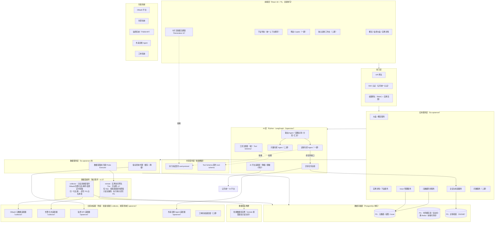
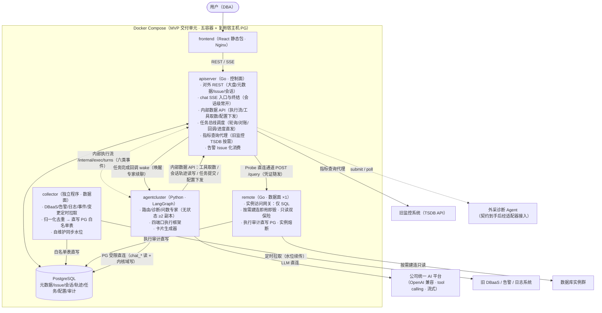
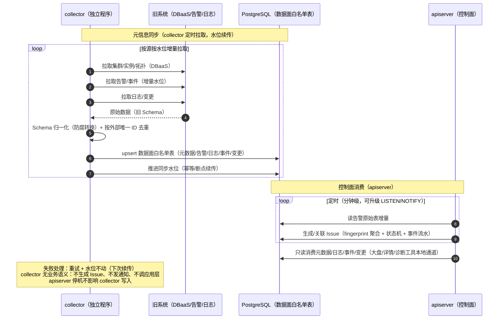
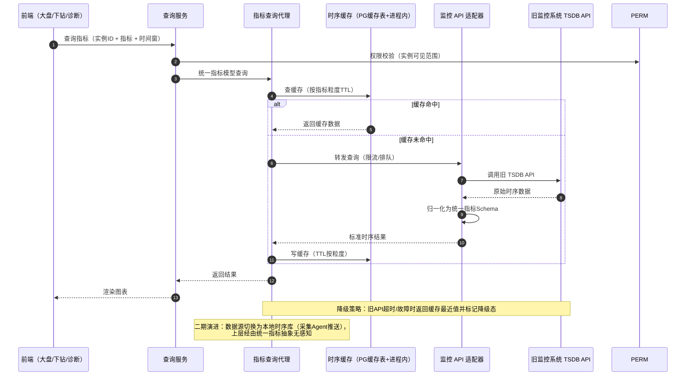
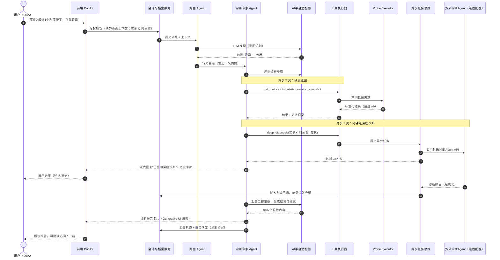
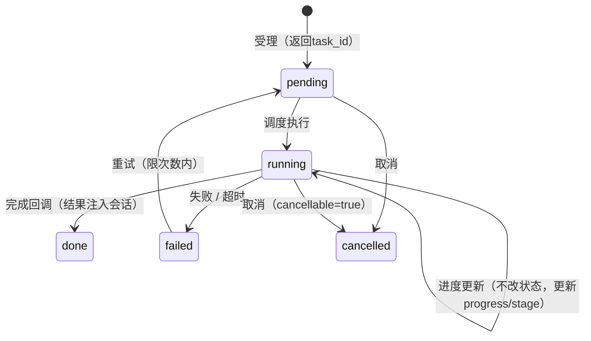
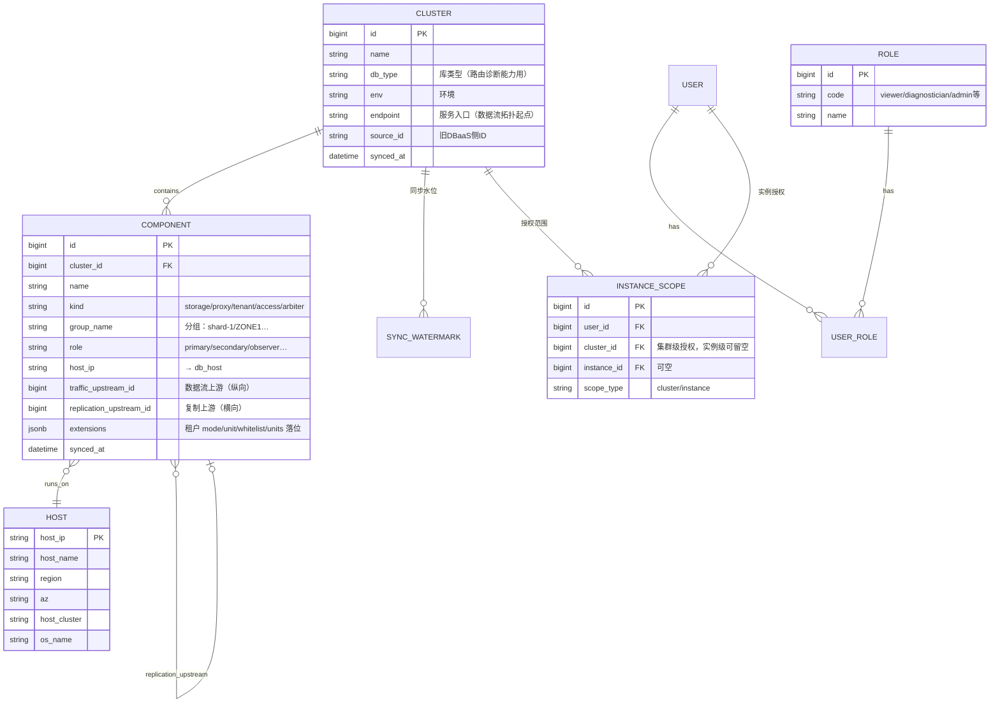
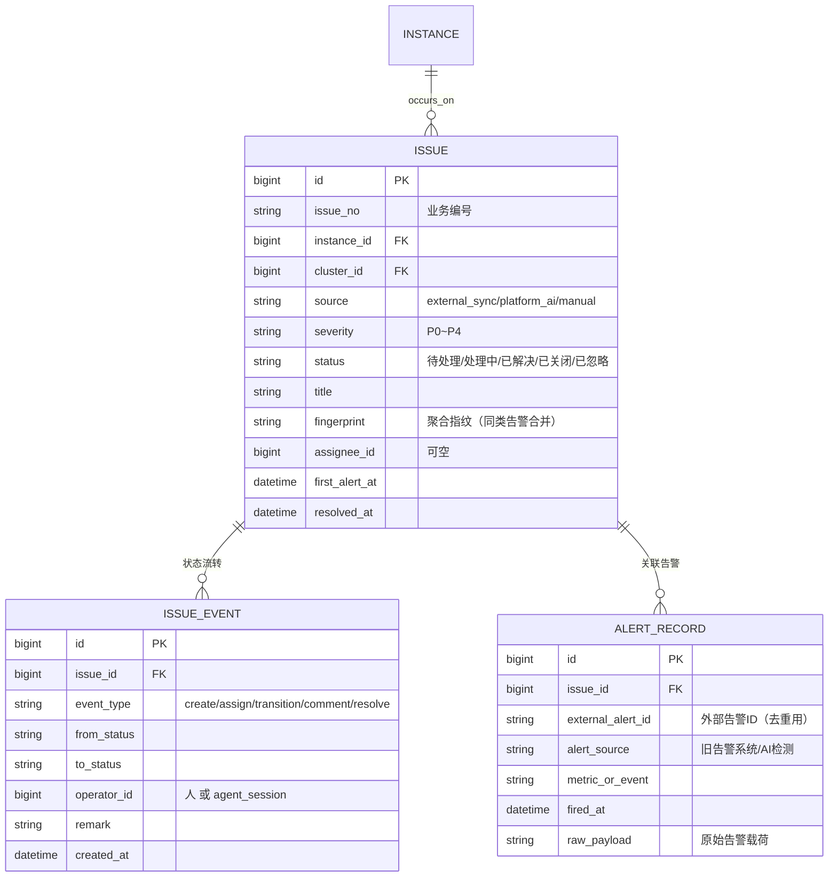
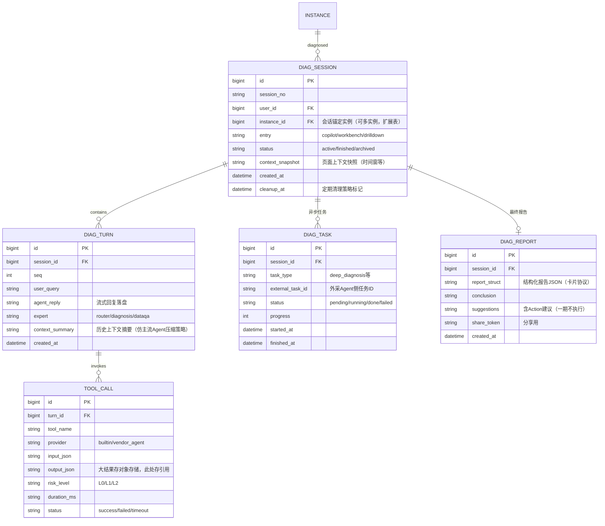

# 数据库 AI 智能运维平台 · 架构设计文档

| 项 | 内容 |
|---|---|
| 文档版本 | v2.3 |
| 日期 | 2026-08-22 |
| 状态 | 已评审（v2.0 依赖规则定稿；v2.1/§6.1.2 数据面白名单落地） |
| 范围 | 整体架构设计，不含代码实现 |
| 实现状态 | 功能级实现进度统一见 `docs/ROADMAP.md`；本文档内「已实现/设计态」在 §6.1.1/§6.1.2 及尾注标注 |

> **变更记录**
> - v2.4（2026-08-24）：**元数据域 v2 实施定稿（D16）**——四层精简模型（db_cluster/db_component/db_host + 水位）落地，零关系表、双自引用字段（traffic_upstream_id/replication_upstream_id）串联关系，host 独立成全局表；OB 租户=组件逻辑单元（units 落位到 observer 组件 id）；§6.1.1 重写为 v2 定稿；DDL 001/seed/handler/meta API 同步更新。
> - v2.3（2026-08-22）：**插件域设计定稿（D15，详见工具注册表 §10）**——agent 插件服务合并进 apiserver（不新增容器）：apiserver 管理插件（mcp_server_configs/skill_configs/tool_definitions）、agentcluster 经 PG 表直读使用（规则②延伸，config_version 轮次边界生效）；MCP(http) 插件生态由二期提前 MVP；MVP 边界 http-only、无 CLI/stdio；工具调用 agent→MCP server 直连（规则③）。§3.4.1 二期演进占位同步修订。
> - v2.2（2026-08-22）：文档重组（docs/design/ + 分类索引见 docs/README.md）——头部补实现状态指引；尾注 8 白名单「表结构待定」更新为已定稿；§10 去人力配比表述（任务分派文档退役，路线图改见 docs/ROADMAP.md）。
> - v2.1（2026-08-22）：**数据面白名单表落地**（§6.1.2）——`alert_raw` / `change_ticket` / `slow_query_log` 建模定稿（`deploy/db/002_whitelist.sql` + GORM），`lock` 表评审结论为**不建**（锁走 remote 实时采集）；指标表继续 mock 待二期。消费端聚合先行：告警 Critical/Major→P1/P2 映射与对象聚合、慢 SQL 指纹聚合（digest GROUP BY）、变更工单时间窗 API、元数据域三级下钻 API（`/api/meta/*`）；演示种子与单测/集成测试/端到端验证全绿（Issue 域状态机仍为后续演进）。
> - v2.0（2026-08-21）：**依赖规则重构**——四条依赖通道定稿（①唯一 exec 调用含 auth_context；②PG 表契约五域分治；③能力经 MCP；④权限注入）；任务改 agent_tasks 表契约（tasks API 与 wake 退役）；配置改直读 PG（拉取 API 退役）；固定专家改为主 agent + 动态 subagent（subagent_defs/workflow_defs 管理面实体）。代码已同步（taskbus/管理面 CRUD/限列写）。
> - v1.4（2026-08-21）：存储收口修订为**三域分治**——agentcluster 直连 PG（读写分域：呈现域只读 + 内核域直写 trace/计量/checkpoint/摘要；Go 统一建模建表；受限角色），取代原「会话/轨迹一律经 Go 内部 API 读写」；§3.4/§3.5/§3.4.1 同步。详见《交互时序与生命周期》v1.3 D32-D34。
> - v1.3（2026-08-20）：数据面拆分——新增 collector（既有独立程序：元信息收集直写白名单表）与 remote（Go · 平台侧 ×1 · 仅 SQL 的实例访问网关）；三收口修订为「控制面/数据面分层」；§3.4 部署改五容器 + 新增 §3.4.1 组件清单总表；§4.2 同步时序改为 collector 主导；Probe 直连通道经 remote。详见《交互时序与生命周期》§6-§8。
> - v1.2（2026-08-20）：SSE 边界由「透明反代」改为「Go 终结点 + Python 内部执行流」（§3.5）；内部 API 扩充执行流/配置下发/注册表端点并约定凭证头与契约版本头；wake 幂等与取消级联语义（§5.6.2）；详见《交互时序与生命周期》。
> - v1.1（2026-08-16）：新增 §3.4 技术选型与物理部署、§3.5 Go↔Python 边界契约、§4.4 指标归一化 MVP 策略、§11 二期能力设计占位（知识库问答/页面上下文/自治页）；存储简化为 PostgreSQL 单库；§10 分期路线按 MVP 共识重定义；§8 补充 MVP 鉴权降级说明。
> - v1.0（2026-08-10）：初版架构共识稿。

---

## 1. 背景与目标

### 1.1 现状
- 部门已有多个存量系统：告警系统、工单系统、DBaaS 平台；
- 已外采诊断 Agent（具备可编程 API 与自带界面，界面不满足需求，前端将全部自建），覆盖大部分国产数据库；
- 旧系统各自独立，数据体系与 API 风格不一。

### 1.2 建设目标
1. 建设多种数据库类型的**综合型智能运维平台**；
2. 保留并重构传统能力：概览页、监控大盘、实例详情；
3. 重点建设**下钻分析**与**智能运维对话式分析**；
4. 一期北极星功能：**数据库实例智能诊断**；
5. 架构具备足够兼容性，适配旧数据体系与 API，支持旧系统渐进替换。

### 1.3 总体策略
**渐进替换（Strangler Fig）**：新建统一平台，自建数据底座与全新前后端；旧系统通过统一适配层集成，按模块分批吸收，最终按节奏下线。

---

## 2. 设计原则

| # | 原则 | 说明 |
|---|---|---|
| P1 | 数据本地化优先 | 低频变化、高频引用的数据落本地，减少运行时对旧 API 的依赖 |
| P2 | 一切可替换处皆抽象 | 指标数据源、诊断能力提供方、模型服务均通过抽象层接入，切换对上层透明 |
| P3 | 防腐层收口 | 所有对旧系统的调用收口于统一适配层，隔离旧 API 的变更与不一致 |
| P4 | Agent 只读提议 | Agent 永不直接执行写操作，动作走三级权限模型，一期仅 L0 只读 |
| P5 | 结构化 AI 输出 | AI 输出遵循结构化卡片协议，前端按类型渲染（Generative UI） |
| P6 | 过程可审计 | 对话、工具调用轨迹、诊断结论全量留痕，沉淀为诊断档案 |

---

## 3. 总体架构

### 3.1 分层组件图



> 图中各逻辑层的**物理归属**（React / Go / Python / PostgreSQL）已在子图标题标注，进程与部署边界详见 §3.4。

### 3.2 分层职责

| 层 | 职责 | 关键决策 |
|---|---|---|
| 前端层 | 双范式交互（浏览式 + 对话式）、下钻、卡片渲染 | 全新技术栈重写，不嵌入旧页面；Copilot 侧栏一期、独立工作台二期 |
| 接入层 | 统一入口、认证鉴权 | 接公司 SSO；RBAC 与实例范围授权全新自建，不复用旧权限数据 |
| 应用服务层 | 业务编排、元数据同步编排、Issue 状态流转、会话与档案管理 | 适配器不直写存储，统一经应用服务入库；告警统一转 Issue，仅平台内流转，不发外部通知 |
| AI 层 | 多 Agent 编排、工具管理、异步任务、模型接入 | Supervisor 模式；专家无状态；复用公司 AI 平台，仅建薄适配层 |
| 数据服务层 | 指标代理查询、按需数据采集、实例直连管控 | 工具不感知数据来源；直连只读 + 审计 + 熔断 |
| 数据存储层 | 元数据、Issue、时序缓存、诊断档案 | 时序存储一期缓存、二期本地时序库 |
| 适配层 | 旧系统调用的防腐出口：批量拉取（DBaaS 元数据/告警/日志）在 collector 内，按需查询（监控 TSDB/外采）在 apiserver 内 | 屏蔽旧 API 差异与变更；批量适配直写数据面白名单表（数据面特例），按需适配不写存储、不调应用层业务 |
| 数据面组件（v1.3） | collector：元信息批量收集直写白名单表；remote：实例 SQL 实时访问网关（仅 SQL、按需建连、只读双保险、审计直写） | 独立程序；控制面（apiserver）只消费数据面表与调用 remote；详见 §3.4.1 |
| 共享契约层 | 卡片协议、Tool Schema 契约包，版本化管理 | 前端与 AI 层相互不依赖，各自只依赖契约（依赖倒置） |

### 3.3 限界上下文与依赖规则

按业务能力划分为 8 个限界上下文：上下文内部高内聚（单一职责、可独立演进），跨上下文仅通过显式接口或领域事件交互：

| 限界上下文 | 内部模块 | 对外提供的能力 |
|---|---|---|
| 元数据与同步 | collector（DBaaS/告警/日志/事件/变更采集）、apiserver 同步消费服务、元数据存储 | 元数据统一读接口、变更领域事件 |
| 监控接入 | 指标抽象层、查询代理、缓存、监控适配器（二期：采集 Agent + 时序库） | 统一指标查询接口（数据源可切换） |
| Issue | 告警接入、Issue 服务、状态机 | Issue 读写与状态流转、Issue 事件 |
| 会话与档案 | 会话编排、轮次/工具轨迹持久化、诊断报告 | 会话 API、档案查询与分享 |
| Agent 编排 | 路由/专家 Agent、工具注册表、异步任务总线、AI 平台适配层 | 对话入口、任务进度回调 |
| 能力接入 | Probe Executor、remote 实例访问网关、插件适配层（MCP/CLI/Skills） | 声明式数据获取、插件注册 |
| 权限 | SSO 对接、RBAC、实例范围授权、权限网关 | 认证与可见范围注入 |
| 呈现契约 | 卡片协议、Tool Schema 契约包 | 双方共享契约（只增不改，破坏性变更需向上兼容） |

**依赖规则（硬约束）**

1. **方向单一**：前端 → 接入层 → 应用层 → AI 层/数据服务层 → 适配层 → 旧系统；禁止反向依赖与跨层调用；
2. **适配层单向**：适配层仅依赖旧系统契约，输出归一化数据与领域事件，不写存储、不调应用层业务——旧系统变更只波及适配层内部；
3. **前后端解耦**：前端与 AI 层互不依赖，各自只依赖呈现契约；新增卡片类型 = 契约扩展 + 渲染器注册，双边零互改；
4. **Agent 端口化**：专家 Agent 仅依赖编排框架四端口（LLM 端口 / 工具端口 / 上下文端口 / 任务端口），不直连任务总线、AI 平台、存储等基础设施——基础设施可替换，专家可复用；
5. **上下文隔离**：跨上下文只走服务接口或领域事件，禁止跨上下文直接访问对方存储；存储逻辑隔离（schema/命名空间边界），支持二期按上下文独立拆库；
6. **契约治理**：共享契约统一版本化、评审准入、CI 一致性校验（如 output_card ↔ card_type 枚举）。

---

### 3.4 技术选型与物理部署（v1.1）

2026-08 架构评审确定的技术栈与部署形态：

| 决策点 | 选型 | 说明 |
|---|---|---|
| 前端 | React 18 + TypeScript + Vite + ECharts | 卡片渲染器注册表 = 组件注册，天然契合；大盘完整复刻 vanilla 原型已验证的编辑器交互 |
| apiserver | Go · 控制面 | 收口所有入口；chat SSE 终结；持有控制面与业务表（数据面白名单表由 collector/remote 直写）；对 Python 暴露内部数据 API |
| Agent 集群 | Python + LangGraph | 按执行框架文档四端口封装（落地映射见该文档 §14）；无状态多副本 |
| collector | 既有独立程序 | 元信息收集（DBaaS/告警/日志/事件/变更）直写数据面白名单表；自维护水位；无业务语义（v1.3） |
| remote | Go · 平台侧 ×1 | 实例 SQL 访问网关：按需建连即用即毁、只读双保险（账号 + SQL 白名单）、执行审计直写 PG、实例熔断（v1.3） |
| LLM 接入 | 公司统一 AI 平台 | OpenAI 兼容协议 + 原生 tool calling + 流式；模型名/端点走 `model_profile` 配置（暂未定名，随时可换） |
| 关系库 | PostgreSQL 单库 | 平台数据量不大；JSONB 承载卡片/轨迹/工具出入参等半结构化数据 |
| 缓存 | 进程内 + PG 缓存表 | 不引入 Redis；指标查询代理的缓存接口保留抽象，量级上来后可无痛替换 |
| 对象存储 | MVP 不引入 | 大结果（慢日志全文等）落 PG JSONB；`TOOL_CALL.output_json` 的引用接口保留，后续可切对象存储 |
| 消息队列 | MVP 不引入 | 任务总线以 `DIAG_TASK` 表轮询实现（DB 为唯一事实源，见 §5.6.2） |
| 部署 | Docker Compose | frontend / apiserver / agentcluster / collector / remote 五容器 + PostgreSQL（复用宿主机既有实例或独立容器）；生产 K8s 后置 |

物理部署与调用关系：



**职责边界原则**（v2.0 修订：四条依赖规则，取代三收口表述）：

1. **入口收口 + 权限注入**：前端一切请求（含 chat SSE）只打 apiserver，认证鉴权仅在 apiserver 统一校验（依赖规则④）；agentcluster 不对外暴露端口，授权结果以 `auth_context` 随 exec 执行流下发，agent 只执行不鉴权；
2. **存储收口（三域分治，v1.4）**：**会话呈现域**（chat_sessions / chat_turns / chat_messages / chat_turn_events）Go 独占读写——SSE 事实源（seq 分配、assistant 装配），agentcluster 只读；**执行内核域**（tool_calls / llm_calls / agent_checkpoints / agent_context_summaries）agentcluster 直连读写，Go 只读（前端轨迹视图）；**数据面白名单**——collector 写六类元信息表、remote 写执行审计表。表结构一律由 apiserver GORM AutoMigrate 统一建模；agentcluster 持受限 PG 角色（chat_* 只读 + 内核域读写）；agentcluster 仍无状态（状态全在 PG），可随意扩缩、重启、shadow 双跑；
3. **防腐收口（分路）**：旧系统**批量拉取**（DBaaS 元数据/告警/日志/事件/变更）收口 collector；数据库实例**实时访问**收口 remote（仅 SQL）；旧监控 TSDB **按需查询**留 apiserver 指标查询代理；外采诊断经 apiserver 任务总线。Python 仍仅感知两类外部依赖——**Go 内部 API** 与 **公司 AI 平台**。

### 3.4.1 组件清单总表（v1.3 新增）

平台实际存在的全部组件及作用（部署拓扑与调用关系见上图）：

**自有组件（六类）**

| 组件 | 形态 | 作用 |
|---|---|---|
| **frontend** | React 18 + TS 静态包（Nginx 容器） | 统一 UI：概览/监控大盘（编辑器复刻）/实例详情/下钻、设置中心（模型/嵌入配置）与插件中心（MCP/Skills）、Copilot 对话 + 卡片渲染器注册表（Generative UI）；只调 apiserver |
| **apiserver** | Go（控制面，Gin + GORM） | 对外 REST 与 SSE 终结（会话级常开 + 心跳）；Go↔Python 内部 API（执行流 /internal/exec/turns、工具取数、会话轨迹、任务、配置下发）；任务总线调度（轮询/对账/wake 回调/进度直发）；Probe Executor 三通道路由（本地表/remote/旧 API）；指标查询代理（旧监控 TSDB 按需 + 缓存）；告警 Issue 化消费；控制面与业务表持有建模；插件/模型/MCP/Skill 配置管理 |
| **agentcluster** | Python + LangGraph（≥2 副本，无状态） | 路由 Agent（意图识别/分发/汇总）+ 诊断/问数专家执行（ReAct 循环、四端口、护栏预算）；卡片生成器；**直连 PG（受限角色）**：呈现域只读装配上下文 + 内核域直写（tool_calls/llm_calls/checkpoint/滚动摘要）；LLM 直连公司 AI 平台；AgentDefinition(YAML) + 注册表/配置拉取编译 |
| **collector** | 独立程序（**既有**，数据面，MVP 单实例） | 元信息批量收集：定时拉取旧 DBaaS（集群/实例/拓扑）、告警系统（告警/事件）、旧日志系统（日志/变更）→ 归一化 + 外部唯一 ID 去重 → **直写 PG 数据面白名单表（六类）**；自维护同步水位（断点续传/幂等）；无业务语义（不生成 Issue、不发通知、不调应用层） |
| **remote** | Go（数据面，平台侧 ×1） | 数据库实例实时访问网关（**仅 SQL**）：承接 Probe Executor「实例直连」通道——凭证由 apiserver 随请求下发（PG 凭证表加密存储）、SQL 语句白名单双保险（只读账号 + 仅 SELECT/SHOW/EXPLAIN）、**按需建连即用即毁**（不池化）、执行审计直写 PG、实例熔断与冷却；命令执行/CLI/采集不归它（二期另定） |
| **postgres** | PostgreSQL 单库 | 统一存储，**三域分治**：呈现域（Go 独占）/ 内核域（agentcluster 直连读写）/ 数据面白名单（collector/remote）；JSONB 承载半结构化数据；部署可复用宿主机既有实例（当前形态）或独立容器 |

**外部依赖**

| 依赖 | 用途 |
|---|---|
| 公司统一 AI 平台 | LLM 推理（OpenAI 兼容 + tool calling + 流式），agentcluster 直连 |
| 旧 DBaaS / 告警 / 日志系统 | 元信息事实源（collector 定时拉取） |
| 旧监控系统（TSDB API） | 时序指标事实源（apiserver 指标查询代理按需查询） |
| 外采诊断 Agent | 深度诊断能力（apiserver 任务总线 submit/poll + vendor 适配器，shadow 注册位） |
| MCP Servers | 插件生态工具（二期，agentcluster 直连持有连接池） |

**二期演进占位**：独立插件执行体（CLI 沙箱 / stdio MCP 托管——插件域 MVP 合并进 apiserver（D15，工具注册表 §10），网络隔离或规模化需求时从插件域拆出独立网关）、本地时序库 + 采集器（自建采集替换旧监控源）、对象存储（大结果外置）。

### 3.5 Go ↔ Python 边界契约（v1.2 修订）

内部 API（Go 暴露、Python 消费），独立监听端口/网络面，与对外 API 分离：

| API 组 | 端点（示意） | 用途 |
|---|---|---|
| 执行流 | `POST /internal/exec/turns`（Go → Python，SSE 响应） | 轮次执行唯一通道：`{turn_id, session_id, user_msg, config_version, resume_of?}`，Python 以六类事件流式回传；替代原「upstream 透明反代」 |
| 工具数据 | `POST /internal/tools/data`（tool_name + input → 标准化输出） | Agent 工具取数唯一入口：指标/告警/慢SQL/会话快照等，Probe Executor 三通道路由在 Go 侧完成 |
| PG 直连（v1.4） | agentcluster ↔ PostgreSQL（受限角色） | 上下文直读（chat_* 只读）+ 内核域直写（tool_calls / llm_calls / agent_checkpoints / agent_context_summaries）+ **管理面只读**（subagent_defs / workflow_defs / model_configs / mcp_server_configs / skill_configs / tool_definitions，D36 配置直读 + D15 插件域）；取代 v1.3 前的 sessions/turns/trace/checkpoints 内部端点组与 v2.0 前的配置拉取端点组 |
| 插件发现（D15） | `POST /api/mcp-servers/:id/discover`（管理 API，非内部通道） | 管理页触发 → **apiserver 直连 MCP Server `tools/list`** → `tool_definitions` 落 draft 草案 → 人工定级 → active；取代原 Go→Python discover 回写链路（`POST /agentcluster/discover`、`POST /internal/registry/tools/draft` 已退役） |
| 任务（已退役，D35） | ~~`POST /internal/tasks`、`GET /internal/tasks/:id`~~、~~`POST /agentcluster/wake`~~ | 由 **agent_tasks 表契约**取代：agent 直写（认领/租约/推进度），Go 只读轮询（进度直发 + done→system_resume 续跑）+ 限列写 notified/cancel_requested |

**SSE 边界（v1.2 修订：Go 终结点模型）**：`FE → GET /api/chat/sessions/:id/stream`（Go 终结，**会话级常开**，15s 心跳）；Go 对 Python 经 `/internal/exec/turns` 建立上游执行流，事件进入 Go 会话总线后转发前端。六类事件（thought/token/card/progress/done/error）Go 只做事件级转发与留痕（`chat_turn_events`，会话内单调 seq），不解析卡片语义。相比 v1.1 的透明反代，该模型补齐四个执行点：任务总线 `progress` 事件直接注入会话总线（不经 Python）；断线重放完全由 Go 承担（前端连接与执行流解耦，FE 断线执行不中断）；同 session 并发轮次仲裁（新轮次取消旧轮次）；shadow 双跑/灰度复制比对。`AGENT_MODE` 语义由「整组路由切换」改为「事件源切换」：上游不可用时逐会话回退 builtin。

**约定**：内部 API 预留服务间凭证头（MVP 无鉴权时不校验，二期接 SSO 时一并启用）；内部契约携带版本头（`X-Contract-Version`），滚动发布期间版本不匹配快速失败。完整时序见《交互时序与生命周期》。

---

## 4. 数据架构：双数据流

### 4.1 数据边界

| 数据类型 | 归属策略 | 数据流类型 |
|---|---|---|
| 集群 / 实例元信息、拓扑 | 本地持久化，collector 定时拉取旧 DBaaS API 同步 | 本地缓存数据流 |
| 告警记录 / 事件 | collector 同步本地留存，apiserver 消费转 Issue；旧系统仍为事实源 | 本地缓存数据流 |
| 时序监控指标 | 一期经指标查询代理拉旧监控 API（带缓存）；二期自建采集 Agent 推送本地时序库 | 远程实时获取数据流（一期）→ 本地数据流（二期） |
| 会话快照 / 锁 / 慢日志 / 执行计划 | remote 按需建连只读采集，不缓存；结论落诊断档案 | 实时采集数据流 |
| 诊断结论 / 报告 | 本地持久化（诊断档案） | 本地沉淀 |

### 4.2 元数据与告警同步时序图（collector 定时拉取，v1.3 修订）



完整采集生命周期时序见《交互时序与生命周期》§6；remote 实时访问链路见该文档 §7。

### 4.3 时序指标查询代理时序图（远程实时数据流）



---

### 4.4 指标归一化 MVP 策略（最小指标集白名单）

旧监控系统指标命名 → 平台统一指标模型的归一，按"最小可用"推进：

| 项 | MVP 策略 |
|---|---|
| 指标范围 | 只归一大盘与诊断所需核心指标白名单（QPS/TPS、连接数、活跃会话、CPU/内存/磁盘/IO、慢查询计数、主从延迟等约 20~30 个），不做全量映射 |
| 映射维护 | 映射表落 PG（源指标名 / 统一指标名 / 单位 / 聚合方式 / db_type）——映射是数据不是代码，新增指标 = 插一行 |
| 未命中处理 | 查询代理对白名单外指标返回明确错误（携带"未注册指标"原因与注册指引），不猜测映射 |
| 演进 | 二期自建采集时，白名单与映射表直接复用，指标抽象层上层无感 |

---

## 5. AI 层架构

### 5.1 多 Agent 编排模型（Supervisor 模式）

| 组件 | 职责 |
|---|---|
| 路由 Agent（Supervisor） | 用户对话唯一入口：意图识别、专家分发、跨专家结果汇总 |
| 编排框架端口 | 专家 Agent 仅依赖四个统一端口：LLM 端口 / 工具端口 / 上下文端口 / 任务端口；任务总线、AI 平台适配层、存储等基础设施挂接于端口之下，可替换 |
| 诊断专家 Agent（一期） | 实例智能诊断：规划诊断步骤、调用诊断工具、生成诊断报告 |
| 问数专家 Agent（二期） | 对平台自有运维数据的 NL2Metric / NL2SQL 查询 |
| 工具注册表 | 统一 Tool Schema：名称 / 描述 / 输入 JSON Schema / 输出 JSON Schema / 风险级别 / 同步或异步；支持 MCP / CLI / Skills 插件生态接入，经插件适配层归一后统一注册（详见《统一工具注册表详细设计》第 7 章） |
| 异步任务总线 | 长耗时工具调用的任务化：task_id、进度推送、结果回调 |
| AI 平台适配层 | 对接公司统一 AI 平台的薄防腐层：统一封装、超时降级、敏感信息过滤、调用审计 |

专家 Agent 全部**无状态**，会话状态、上下文、工具调用轨迹由共享底座（会话与档案服务）承载，支持独立迭代与灰度。执行框架的完整设计（Agent 定义模型、ReAct 执行循环、四端口契约、上下文管理、任务续聊闭环、护栏预算、流式协议、部署形态）见《Agent 执行框架详细设计》；v1.1 起执行运行时确定为 **Python + LangGraph 承载**（四端口封装与概念映射见该文档 §14，Go↔Python 边界契约见本文档 §3.5）。

### 5.2 诊断工具能力分工（能力插件 + 注册表）

| 能力类别 | Provider | 说明 |
|---|---|---|
| 国产数据库深度诊断 | 外采诊断 Agent（经 API 封装，黑盒工具） | 契约：实例 ID + 时间窗 + 症状描述 → 结构化诊断报告 |
| 通用诊断工具（会话/锁/慢SQL/执行计划解读、指标异常检测、告警关联） | 自建工具集 | 覆盖高频场景，避免单点依赖 |
| 生态插件能力（慢日志分析、专项排查流程等） | MCP Server / CLI 工具 / Skills，经插件适配层归一注册 | 快速引入社区与自研生态能力，不侵入架构 |
| 路由机制 | 工具注册表按实例 db_type 元数据路由 | 库类型清单是注册表数据，不进架构 |

### 5.3 数据获取执行器（Probe Executor）

诊断工具**不感知数据来源**，只声明数据需求（如 `session_snapshot(instance_id)`、`slow_queries(instance_id, window)`），由执行器按数据类型 + 实例路由：

| 通道 | 数据 | 说明 |
|---|---|---|
| a 本地沉淀 | 元信息、告警、Issue、指标代理数据 | 直接查本地 |
| b 实时直连 | 会话、锁、慢日志、执行计划 | 经 remote 访问网关（平台侧 Go 程序）：凭证随发 + SQL 白名单双保险 + 按需建连即用即毁 + 执行审计直写 PG + 实例熔断 |
| c 旧系统 API | 旧系统已有分析结果 | 经防腐层，未来可被通道 b 替换，工具层零改动 |

### 5.4 多 Agent 诊断调用时序图



### 5.5 动作安全模型（三级）

| 级别 | 示例 | 执行策略 | 分期 |
|---|---|---|---|
| L0 只读 | 查会话、慢SQL、执行计划、拉指标 | Agent 自主执行，仅审计 | **一期** |
| L1 低风险变更 | kill 会话、清理临时表 | Agent 提议 → Action 卡片 → 用户确认 → 动作网关执行 | 二期 |
| L2 高风险变更 | 重启、主备切换、DDL | Agent 仅出建议，走旧工单系统审批 | 三期 |

Agent 永远只能产出标准化 `Action` 对象（动作类型 / 目标实例 / 参数 / 风险级别 / 预期影响 / 回滚方案），不直接执行。

### 5.6 Agent 间通信与任务状态管理

#### 5.6.1 通信机制：黑板模型 + 消息通道

原则：**Agent 之间不点对点直连**，一切通信经编排框架的消息通道与共享会话中转——通信全程可审计（随会话轨迹落库）、上下文可控（防止专家间互相污染上下文）、拓扑可演进（新增专家不改通信代码）。

统一消息协议 `AgentMessage`：

```json
{
  "msg_id": "msg_01J9...",
  "session_id": 10231,
  "turn_id": 102310004,
  "from": "router",
  "to": "diagnosis_expert",
  "type": "handoff",
  "context_pack": {
    "instance_id": 512,
    "time_range": { "start": "...", "end": "..." },
    "objective": "定位实例响应变慢根因",
    "prior_summary": "前轮已确认CPU正常、活跃会话激增"
  },
  "payload": { },
  "created_at": "2026-08-10T14:32:00+08:00"
}
```

四种通信模式：

| 模式（type） | 方向 | 说明 |
|---|---|---|
| `handoff` | 路由 Agent → 专家 Agent | 传结构化上下文包而非完整对话：实例上下文 + 时间窗 + 任务目标 + 前轮摘要 |
| `report` | 专家 Agent → 路由 Agent | 结构化结果摘要，供路由 Agent 跨专家汇总后回复用户 |
| `task_event` | 任务总线 → 会话服务/当前 Agent | 异步任务进度/完成/失败事件，完成后结果注入对应轮次 |
| `user_msg` / `summary` | 会话服务 ↔ Agent | 用户输入分发；历史轮次摘要压缩后的上下文注入 |

约束：二期+的跨专家协作必须走 `专家 → 路由 Agent → 另一专家` 中转，禁止专家点对点通信。

#### 5.6.2 任务状态管理：数据库为唯一事实源

状态机：



持久化与容错规则：

| 规则 | 说明 |
|---|---|
| 唯一事实源 | `DIAG_TASK` 表（含外采侧 `external_task_id`）；内存调度器仅作加速器，重启后从表恢复：`pending` 重新调度，`running` 超时任务经 `external_task_id` 向外采 Agent 对账后改判 |
| 状态流水 | 每次状态迁移写 `task_event` 流水（任务ID / 事件 / 前态 / 后态 / 时间戳），供进度卡渲染与故障回溯 |
| 幂等防重 | `call_id` 全局唯一 + 工具 `rate_limit`，防 Agent 规划循环重复提交分钟级任务 |
| 续跑触发（v2.0） | wake 回调退役：apiserver 轮询 agent_tasks 检出 done → 创建 system_resume 轮续跑；agent_tasks 表为唯一集成通道（D35） |
| 取消级联（v2.0） | 用户取消轮次时对 agent_tasks **限列写** cancel_requested=true；agent worker 观察后中止并置 cancelled |
| 回写闭环 | 任务绑定 `session_id/turn_id`，完成后结果注入该轮次并生成结果卡（进度卡 → 诊断报告卡） |
| 可观测 | 任务总线面板：积压量、平均耗时、失败率、对账差异数 |

### 5.7 Agent 部署形态：常驻服务 vs 临时派发

前提：专家 Agent 是**无状态推理逻辑**（提示词 + 工具绑定 + 模型配置），不是进程；常驻/派发选择的是执行容器形态。专家无状态 + 状态在共享底座是本节成立的前提。

**判据：同步交互 → 常驻；异步批处理 → 临时派发。**

| Agent / 工作负载 | 形态 | 理由 |
|---|---|---|
| 路由 Agent | 常驻服务 | 对话唯一入口，高频低延迟，无状态水平扩展 |
| 专家交互式推理（规划/秒级工具/流式回复） | 常驻服务 | 用户等待中，冷启动不可接受；实例无状态 |
| 分钟级深度诊断 | 无常驻进程 | 异步任务：外采 API + 任务总线编排 |
| 批量任务（二期巡检批处理/报告生成/夜间分析） | 临时派发 Worker | 跑完即销，按积压弹性伸缩，可缩容到零 |
| 定时任务（容量周报/趋势分析） | 定时触发的临时派发 | 本质是批处理 |

工程实现：统一 **Agent 执行框架**——同一专家定义可挂为常驻推理服务，也可被任务总线拉起为 Worker 容器；两条路径共用工具注册表与会话回写链路，形态差异对上层透明（同插件归一哲学）。

反模式警示：
1. 每轮对话临时派发进程——冷启动毁掉对话体验；
2. 单一巨进程承载所有专家——无法独立扩缩容与灰度；一期可共享进程池，专家增多后按专家拆独立服务。

**本平台选型结论：一期"常驻为主 + 任务化异步"。**

| 一期组件 | 部署 |
|---|---|
| 路由 Agent + 诊断专家 | 单一常驻 Agent 推理服务（共享进程池，无状态，≥2 副本，按并发会话水平扩展） |
| 分钟级深度诊断 | 轻量常驻任务总线：受理 → 调外采 API → 对账/回调写回；执行体在外侧，无需 Worker 池 |
| Worker 容器派发体系 | 一期不建；演进触发点：二期出现"分钟级以上、平台侧自算"的任务（批量巡检/报告生成）时再建 |

> **物理承载（v1.1）**：MVP 以 Docker Compose 交付——任务总线调度内置于 apiserver（Go）：受理 → 轮询外采/执行体 → 对账 → 回调 agentcluster（Python）唤醒专家续聊；agentcluster 为无状态常驻推理服务（≥2 副本）。MVP 注册一个自建异步工具（长时窗多指标异常扫描，Go 侧执行体）用于验证异步任务全闭环，不依赖外采。详见 §3.4/§3.5。

---

## 6. 核心数据模型草案

> 说明：以下为核心实体草案，字段级细节待详细设计阶段补充。

### 6.1 元数据域



#### 6.1.1 元数据域 v2 定稿（D16，2026-08-24）

元数据域物理表采用**四层精简模型**（3 域表 + 水位表），零关系表，双自引用字段串联关系：

| 物理表 | 角色 | 承载内容 |
|---|---|---|
| `db_cluster` | 集群层（逻辑包含顶层 + 服务入口） | 业务归属、环境、HA/备份/切换模式、**端点上移**（endpoint/vip/port/username/role_selector） |
| `db_component` | 组件成员统一表（v2 核心） | 行 = 成员/逻辑单元：引擎成员（pg 节点/observer）、代理成员（obproxy/mongos/haproxy）、租户逻辑单元。**双自引用字段**：`traffic_upstream_id`（数据流上游·纵向·实线）、`replication_upstream_id`（复制上游·横向·虚线，备→主；Paxos/多主置空）；`extensions` 承载租户 mode/unit/whitelist + **units:[{instance_id → db_component.id, zone}]** N:M 落位 |
| `db_host` | 独立全局主机表 | 位置三级（region/AZ/主机集群）唯一存储点；组件成员经 `host_ip` 挂载（同机多进程天然表达） |
| `db_sync_watermark` | 同步水位 | collector 断点续传/幂等去重 |

**三条显式约定（D16）**：
1. **纵向按层渲染**：数据流默认按 kind 层级画组间连线，成员级 `traffic_upstream_id` 为可选精化（解决 mongos 多入口 N:M）
2. **upstream 允许跨集群指向**（component id 全局唯一——支持 HBase→HDFS 依赖与跨机房 DR 复制）
3. **规模边界**：千级分区级实体（Kafka partition/单 shard 行）不建组件行，建模到 broker/节点/代理层

**extensions 提升规则**：某键成为高频过滤/强约束需求时提升为显式列（character_set 先例），而非类型子表；「独立生命周期 + 跨行 JOIN + 报表级聚合」三条件齐备才评估类型子表（如 db_tenant_spec 挂 component_id）。

**多库类型覆盖示例**：
- **PG**：storage 成员 ×3（两备 replication→主 + 1 主 1 备），VIP 在 db_cluster 端点
- **MySQL+proxy**：proxy 成员 + storage 成员（traffic→proxy 成员，备 replication→主）
- **MongoDB 分片**：mongos(proxy) / shard-N(storage, group_name=shard-N) / configsvr(arbiter)
- **Redis Cluster**：storage 成员 ×6（group_name=shard-1..3 主备；去中心化 traffic 置空）
- **OceanBase**：obproxy(proxy) + tenant 逻辑单元（traffic→obproxy，units 落位到 observer 组件 id）+ observer 成员（group_name=ZONEx，Paxos 置空复制字段）
- **跨机房 DR**：replication_upstream_id 跨集群指向对端成员（约定 ②）

**迁移映射（v1 → v2）**：旧 db_instance（逻辑服务）→ cluster（端点）+ db_component（成员）；旧 db_instance_node → db_host（host 字段）+ db_component（副本语义）；「sys 租户挂节点」约定废止（成员挂组件 + 主机）。v1 环境需 DROP db_instance / db_instance_node 后重建。

**查询支撑**：`db_cluster(db_type/environment/name)` 索引支撑大盘与集群列表过滤；集群详情按 `db_component(cluster_id)` 下钻（含 kind/group_name/双上游字段/extensions.units）；主机视角按 `db_component(host_ip)` 反查；物理拓扑按 `db_host(region/az/host_cluster)` 分组。

**写入边界**：本域为数据面白名单表，collector 直写、apiserver 只读消费；与现有 UI 演示模型 `clusters/instances` 并存，接入真实数据后由 `db_*` 表供前端消费。

#### 6.1.2 数据面白名单表落地（v2.1）

旧系统导出表（`ddl.sql`）评审定稿（基准 `deploy/db/002_whitelist.sql`，GORM 建模 `model/metadata.go`）：

| 物理表 | 来源（ddl.sql） | 定位 | 消费方式（apiserver 只读聚合） |
|---|---|---|---|
| `alert_raw` | `alerts`（40 列） | 原始告警事件，`event_id` 去重锚点，长尾字段收 `raw` jsonb | 按对象+标题+级别聚合出告警中心视图（Critical→P1 / Major→P2 / 其余→P3，`min(fired_at)` 首触、`count` 次数）；Issue 化（fingerprint/状态机）在 §6.2 Issue 域后续实现 |
| `change_ticket` | `changes`（14 列） | 变更工单，varchar 日期改 timestamptz，补集群/实例关联 | `GET /api/changes`：风险级别/对象/执行时间窗（闭区间）过滤，供诊断关联「当时是否有变更」 |
| `slow_query_log` | `slow_query`（10 列） | 每次执行一行的事件流，补 `digest` 指纹与 `instance_id` 关联 | 按 digest GROUP BY 聚合出 SQL 诊断视图（平均耗时/最大扫描行数/执行次数）；实时慢日志快照走 remote，不落本表 |
| —（不建） | `"lock"` | 锁状态秒级时效，落库即过期 | 按 §4.1 走 remote 实时采集，结论落诊断档案；将来死锁历史审计另立 `deadlock_event` 类事件表 |
| —（待二期） | `series_meta` / `series_points` | 指标 | 继续走 mock/指标代理，二期本地时序库另定 |

要点：

- **消费端加工原则**：白名单表保持源值（级别原值、状态码、varchar 语义映射均在消费端完成），collector 无业务语义；演示种子按同一原则 mock（告警/慢SQL 聚合视图与原演示数据逐值一致）。
- **对象关联**：三表均带可空 `instance_id`/`cluster_id` 逻辑外键；演示数据由种子回填，真实接入后由 collector best-effort 回填或消费端 JOIN 元数据域。
- **演示实例 → 元数据实例解析**（慢SQL 按实例过滤）：名称精确匹配 → endpoint（ip:port）→ OB 租户 `extensions.units`（unit 所在 server_ip）兜底；解析失败回退全局。
- **回退兼容**：白名单空表时 `/api/alerts`、slow-sqls、大盘回退 UI 演示表（`alert_records`/`slow_sqls`），老部署不受影响。
- **测试**：纯函数单测（级别映射/格式化/时间参数容错）+ PG 集成测试（marker 自建自清：聚合正确性、回退、404、非法参数、时间窗闭区间边界、`+08:00` 未编码容错）+ 端到端实机验证。

### 6.2 Issue 域（告警 Issue 化）



要点：
- 新平台**不对外发通知**，Issue 仅平台内状态流转；对外通知职责仍归旧告警系统；
- 平台自身（含 AI 异常检测）产生的告警同样落入 Issue，`source=platform_ai`；
- `fingerprint` 支持同源告警聚合，避免 Issue 爆炸。

### 6.3 诊断档案域（会话 / 轮次 / 任务 / 报告）



要点：
- 会话全量落库 + 定期清理（`cleanup_at` 由保留策略任务维护）；
- `DIAG_TASK` 状态迁移经 `task_event` 子表留痕（任务ID / 事件 / 前态 / 后态 / 时间戳），支撑进度卡渲染与重启后恢复；
- 上下文管理仿主流 Agent 实践：`context_summary` 对旧轮次做摘要压缩，当前页面上下文动态注入；
- 大型工具输出（如完整慢日志）存对象存储，`TOOL_CALL.output_json` 存引用，控制关系库体积。

### 6.4 任务建模原则：不按类型拆表，按生命周期拆表

**判据：生命周期/状态机相同则统一主表，不同则分表。**

| 任务类别 | 建模归属 | 理由 |
|---|---|---|
| AI 会话内异步工具任务（深度诊断、批量分析、报告生成等） | `DIAG_TASK` 统一主表 | 同一状态机/调度/恢复逻辑；类型差异由 `task_type + input_json/output_json` 吸收（结构由工具注册表 Schema 自描述），需结构化检索时再加一对一扩展子表 |
| 平台调度任务（元数据同步、清理、对账） | 调度器自有任务表（元数据与同步上下文） | 无会话绑定，cron 语义与重试策略不同 |
| L1/L2 动作执行（二/三期） | 动作域独立表 | 含确认/审批环节，状态机与审计要求不同 |
| 外采 Agent 内部子任务 | 不建模 | 黑盒，仅持 `external_task_id` 对账 |

收益：任务总线/状态机/恢复对账只建一套，新增任务类型 = 注册表注册 async 工具，零表结构变更；`task_type` 是数据而非架构分支（同 `db_type` 路由原则）。

---

## 7. 前端架构

| 设计点 | 决策 |
|---|---|
| 技术策略 | 全新技术栈重写（React 18 + TypeScript + Vite + ECharts），单一新应用，不 iframe / 微前端嵌入旧页面 |
| 交互范式 | 双范式并列：浏览式（大盘/下钻）+ 对话式（Copilot），双向流转 |
| 对话入口 | 一期侧边 Copilot（跟随页面上下文）；二期独立诊断工作台，会话可"升级"流转 |
| 下钻模型 | 概览 → 集群 → 实例 → 会话/慢SQL/锁；全程携带统一上下文（实例ID + 时间范围）；任意元素可一键带入对话 |
| 监控大盘 | 本地自建大盘为唯一形态，不嵌入 Grafana；面板数据模型复刻 Grafana：多查询 targets → 多序列同轴叠加、双 Y 轴、序列级样式覆盖、阈值分段着色、事件标注（发布/切换/告警叠加时间轴）、Stat 单值、下钻链接、12 列自由布局、时间偏移对比；指标经统一查询协议（metric/scope/range/shift → SeriesData/Annotations）由后端接口供给，前端 mock/API 双 Provider 并存，后端就绪后零改动切换；大盘配置持久化，后续可共享/版本化；React 版**完整复刻** vanilla 原型已验证的编辑器交互（多大盘管理/面板编辑/12列自由布局/序列级样式/阈值分段/预览折叠） |
| Generative UI | AI 输出结构化卡片协议（JSON Schema 定义 card_type）；前端维护"卡片渲染器注册表"，新卡片类型无需改协议 |
| 过程透明 | 可折叠的 Agent 工具调用轨迹视图，建立 DBA 信任 |
| 全局入口 | ⌘K 命令面板：自然语言导航与快捷操作（二期） |
| 诊断档案 | 每次诊断沉淀为可检索、可分享、可续聊的一等公民工件 |

**关于监控大盘"直接拷贝 Grafana 代码"的可行性结论**：不可行，原因有三：

1. **许可风险**：Grafana 前端代码为 AGPLv3 许可，直接拷贝要求本项目同样以 AGPLv3 开源，与平台内部定位冲突；
2. **工程形态不匹配**：Grafana 前端为 Angular/React 巨石工程，且渲染、数据流与其后端数据源插件体系深度耦合，剥离成本远高于重写；
3. **接入模型不同**：本平台指标统一经指标查询代理的抽象层供给，天然适配自建的轻量数据源插件，无需 Grafana 的完整插件生态。

**替代策略（已实施于原型）**：复刻其面板数据模型与交互——panel = 多 targets（query）→ 多序列同轴叠加 → 序列级覆盖（名称/颜色/左·右 Y 轴/图表类型/单位）→ 面板级阈值/事件标注/图例/图型，用 ECharts 承担渲染。灵活度对齐 Grafana 的核心使用方式（同 panel 多指标同轴、双轴对比、阈值着色、事件标注、下钻），且无许可与耦合负担。

**大盘查询协议（统一查询数据层）**：面板声明查询（metric / scope / range / shift），经 `fetchSeries` / `fetchAnnotations` 异步取数，返回统一 SeriesData 与事件列表；MockProvider 与 ApiProvider 双实现并存（P2 抽象原则），后端接口就绪后切换 Provider 即可，渲染层零改动；ApiProvider 内置失败降级回退 mock。

---

## 8. 安全与权限

| 域 | 决策 |
|---|---|
| 身份认证 | 接公司统一 SSO，不自建账号体系，不信任旧系统会话 |
| 功能权限 | 平台自建 RBAC（角色 → 功能：查看 / 诊断 / 问数 / 管理），不复用旧权限数据 |
| 数据权限 | 实例范围授权（集群级 / 实例级），权限判定本地完成 |
| AI 侧权限 | 对话查询经权限网关注入可见实例范围（NL2Metric 防越权） |
| 实例直连 | 统一 remote 访问网关：凭证表（加密）随发、只读双保险（账号 + SQL 白名单）、执行审计直写 PG、超时熔断；禁止工具自建连接 |
| 模型数据安全 | AI 平台适配层内置敏感信息过滤与调用审计 |

> **MVP 降级（v1.1 共识）**：内网开发验证阶段平台**无鉴权**——权限网关以"全量实例范围"的桩实现接入（接口与调用链保留，二期接 SSO/RBAC 后替换桩即可）；remote 访问网关的只读双保险/执行审计/超时熔断**不降级**（直连生产实例的安全底线）。

---

## 9. 兼容性策略（旧系统集成收口）

旧系统调用按**批量拉取 / 按需查询**分路收口（v1.3）：批量拉取唯一出口为 **collector**，按需查询与异步调用唯一出口为 **apiserver**；一期集成点收敛为：

| 集成点 | 归属 | 方向 | 用途 |
|---|---|---|---|
| DBaaS 元数据适配器 | collector | 拉取（定时） | 集群/实例/拓扑同步 |
| 告警/日志适配器 | collector | 拉取（增量水位） | 告警/事件/日志/变更同步（apiserver 消费 Issue 化） |
| 监控 API 适配器 | apiserver | 按需查询 | 时序指标查询代理的上游 |
| 外采诊断 Agent 适配器 | apiserver | 调用（异步） | 封装为诊断工具，黑盒契约 |
| 工单系统适配器 | apiserver | —— | 三期 L2 动作审批时启用 |

适配器层统一承担：Schema 归一化、重试与水位、限流、版本兼容（旧 API 变更仅改适配器）。

---

## 10. 分期路线（v1.1 重定义）

| 期 | 范围 |
|---|---|
| **MVP（真实数据接入；实现进度见 docs/ROADMAP.md）** | ① 数据底座：PG 单库 + collector 接入（既有程序：DBaaS 元数据/告警/日志同步直写白名单表）+ 告警 Issue 化 + 指标查询代理接真实旧监控 API（最小指标白名单，§4.4）；② Go apiserver：对外 REST + chat SSE 终结 + 内部数据 API + 任务总线调度 + 指标查询代理 + remote（Go · 平台侧 ×1）实例只读访问网关；③ Python agent 集群：LangGraph 四端口封装 + 路由/诊断/问数专家 + 自建诊断工具集（指标异常/会话快照/慢SQL/锁分析）+ 卡片输出；④ 前端 React 重写：大盘（完整编辑器复刻）+ 多会话 chat + 卡片渲染器注册表；⑤ 外采诊断：落地 vendor_agent 适配器规范与 shadow 注册位（契约到手后仅实现适配器即接入，不阻塞交付）。**明确不做**：鉴权/SSO、页面上下文注入、自治服务页、知识库问答、L1/L2 动作、Redis/MQ/对象存储、MCP/CLI/Skills 插件生态 |
| **二期** | 知识库问答：help_expert + 平台说明书 RAG + open_link URL 跳转（§11.1）；页面上下文注入与行级"问AI"（§11.2）；SSO + RBAC + 实例范围授权（替换权限桩）；自治服务页：异步任务中心 + 建议展示 + 手动触发（§11.3）；外采诊断正式接入（若 MVP 期内未完成）；L1 动作提议与确认执行；Redis/对象存储按需引入；MCP/CLI/Skills 插件生态；自建采集 Agent + 本地时序库（数据源切换） |
| **三期** | L2 动作衔接旧工单审批；更多领域专家 Agent；⌘K 命令面板；旧系统模块分批下线 |

---

## 11. 二期能力设计占位（v1.1）

### 11.1 知识库问答（help_expert + 说明书 RAG + URL 跳转）

愿景：AI 自带平台"说明书"，回答用户问题时能给出平台内页面跳转 URL，指导用户操作。

| 设计点 | 方案（占位，二期出详细设计） |
|---|---|
| 专家 | 新增 `help_expert`（知识专家），挂接路由 Agent `handoff_targets`；承接平台使用/功能咨询类意图 |
| 知识源 | ① 平台使用说明书（文档）；② 前端页面路由表（path + 标题 + 功能描述 + 关键组件说明）——路由表由前端构建产物生成，保证与页面同步演进 |
| 检索 | 说明书与路由表分块向量化（embedding 经 LLM 端口），pgvector 承载，检索命中注入 help_expert 上下文 |
| 输出 | text 卡正文 + `open_link` 交互（卡片协议 §6.1）：`{url: "#/instance/:id/sessions", label: "前往实例详情·会话面板"}`，前端路由内跳转 |
| 边界 | 只答平台使用与运维知识，不做诊断（诊断意图 handoff 回诊断专家） |

### 11.2 页面上下文注入与元素选中诊断（简版）

- 页面上下文（实例/集群/时间窗/当前面板）经 `ContextPort.inject_page_context` 自动注入会话（执行框架 §5.3 已预留，MVP 留桩）；
- 交互简版：`data_table` 行级"问AI"、图表卡追问按钮，将行数据/指标名注入对话——**不做**任意元素划词/悬浮选中；
- 前端随 React 重写埋点：页面容器统一携带 context 快照，chat 发送时附带。

### 11.3 自治服务页

异步任务中心（深度诊断任务列表/进度/报告入口）+ 诊断建议展示（只读）+ 手动触发深度诊断（复用 chat 的异步任务机制）；自动执行（L1+）不在此页范围（走 L1 动作确认链路）。

---

## 附录 A：关键术语

| 术语 | 含义 |
|---|---|
| 双数据流 | 本地缓存数据流（定时同步沉淀）与远程实时获取数据流（按需查询旧系统）并存 |
| Probe Executor | 数据获取执行器：诊断工具声明数据需求，执行器路由到本地/直连/旧API三通道 |
| 防腐层（ACL） | 隔离旧系统 API 差异与变更的适配层 |
| Supervisor 模式 | 路由 Agent 统一入口分发，领域专家 Agent 分工执行的多 Agent 拓扑 |
| Generative UI | AI 输出结构化卡片、前端按类型渲染的交互模式 |
| Issue 化 | 告警统一转为平台内部工单式实体，仅状态流转、不发外部通知 |

---

## 附录 B：MVP apiserver 落地契约（2026-08 实施修订）

Go apiserver（`apiserver/`，Gin + GORM，存储复用既有 PostgreSQL 独立库 `db_cockpit`）已按前端页面落地，对 §7 查询协议与 §3.5 边界做如下实施修订：

1. **响应包裹**：面向前端的全部 REST 接口统一包裹 `{code, message, data}`（成功 `code=0`；错误保留 HTTP 4xx/5xx，`code` 镜像错误码）。`/api/dash/series|annotations` 同样包裹（前端 `query.ts` 已加解包适配）。例外：`GET /healthz` 裸 "ok"；Chat SSE 为事件流不包裹。
2. **Chat SSE**：`GET /api/chat/sessions/:id/stream`（六事件 thought/token/card/progress/done/error），`id:` 行携带会话内单调序号，支持 `last_event_id` / `Last-Event-ID` 断线重放；事件落库 `chat_turn_events`。MVP 由 Go 内置模拟 agent（移植前端 mockAgent 场景脚本）产生；agentcluster 就绪后 `AGENT_MODE=upstream` 切换**事件源**：Go 经 `POST /internal/exec/turns` 消费 Python 执行流并经会话总线转发（v1.2 起 Go 终结 SSE，不再整组反代；详见 §3.5 与《交互时序与生命周期》）。
3. **指标序列**：服务端按与前端 MockProvider 相同的确定性算法（mulberry32 种子随机游走）生成，同一请求参数与原 mock 输出逐值一致（对拍黄金向量见 `apiserver/internal/metrics/metrics_test.go`）。
4. **会话/大盘存储迁移**：Chat 会话与监控大盘改为服务端主存储（`chat_sessions/chat_messages`、`dashboards` JSONB），前端 localStorage 首次访问时一次性导入，apiserver 不可达时回退本地 mock 继续演示。
5. **写操作（模拟语义）**：创建库/租户/账号、参数修改（pending + 历史）、Kill 会话、切换演练、Unit 扩缩容均为对 `db_cockpit` 的真实状态变更，危险操作写 `audit_logs`。
6. **内部接口**：`/internal/*`（§3.5）路由已注册、一律 501 `{code:1001}`，待 Python 侧就绪后挂实现。
7. **接口金样**：`contracts/api/*.json` 为各端点实测响应快照，是前后端联调与回归的契约基线。
8. **数据面拆分（v1.3 规划，表结构已于 v2.1 定稿）**：collector（既有独立程序）直写数据面白名单表（六类，定稿进展见 §6.1.1/§6.1.2 与《交互时序与生命周期》§8.2；基准 SQL `deploy/db/`）、remote（Go · 平台侧 ×1 · 仅 SQL）承接 Probe 直连通道——**两程序尚未进 compose**（落地时按 §3.4.1 组件清单追加服务，五容器形态，PG 复用宿主机既有实例）；白名单消费端聚合已先行（告警/慢SQL/变更/元数据下钻 API）。
