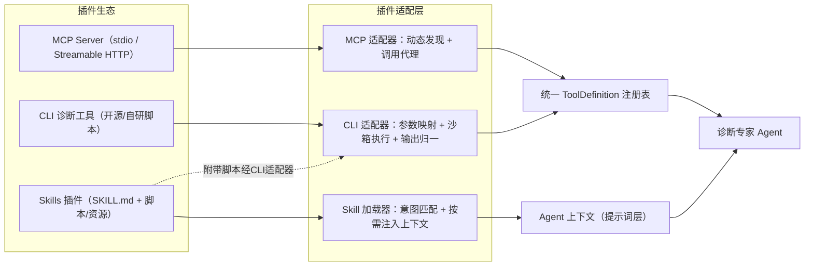

# 统一工具注册表（Tool Schema）· 详细设计

| 项 | 内容 |
|---|---|
| 文档版本 | v1.7 |
| 上游文档 | 《数据库AI智能运维平台架构设计文档》第 5 章（AI 层） |
| Schema 版本 | tool-schema/1.0 |
| 状态 | 设计定稿 |
| 实现状态 | **插件域（apiserver 侧）已实施**：`tool_definitions`/`config_versions` 表、mcp/skill 补字段、发现/健康/定级 4 端点、stdio 拒绝、版本自增、种子与全量测试（§10.8）；**待 agentcluster**：表直读消费与 builtin 工具 MCP 化（`tools/data` 现 501）；实现进度见 docs/ROADMAP.md |

> **变更记录**
> - v1.7（2026-08-23）：**插件域 apiserver 侧实施完成**——`internal/mcpclient` 最小 http 客户端（JSON/SSE 双承载、握手宽松）、4 个管理端点、重复发现 upsert/消失置 deprecated/转 active 需 risk 定级/删除级联等语义落地（§10.8）；mcp/skill 配置补 version/status/base_url，stdio 校验拒绝；新增 `config_versions` 表承载管理面版本。
> - v1.6（2026-08-22）：**插件域落地设计定稿（§10）**——MCP(http) 插件生态由二期提前 MVP；§7 生命周期对齐 v2.0 依赖规则：agentcluster 改 **PG 直读** `tool_definitions`（`GET /internal/agent/registry` 拉取退役）、发现改 **apiserver 直连 server 调 `tools/list`**（Go→Python discover 回写链路退役）；MVP 边界：http-only MCP、无 CLI/stdio。
> - v1.5（2026-08-22）：文档重组（docs/design/）——头部补实现状态。
> **变更记录**
> - v1.4（2026-08-21）：依赖规则③落地——`POST /internal/tools/data` 定位为 **MVP 过渡通道**，工具按数据域逐个 MCP 化（每域一个 MCP Server，remote/防腐能力下沉其下）后退役；§8 表中数据来源标注过渡语义。
> - v1.3（2026-08-20）：数据面对齐——「实例接入网关」职责由独立程序 **remote** 承接（Go · 平台侧 ×1 · 仅 SQL · 按需建连即用即毁 · 只读双保险 · 执行审计直写 PG，见架构文档 §3.4.1）；§5/§7.1/§7.2/§8 措辞同步；CLI 沙箱执行体归属标注二期另定。详见《交互时序与生命周期》§7/§8。
> - v1.2（2026-08-20）：§7 补插件生命周期与归属——ToolDefinition 注册表入库（Go PG `tool_definitions` + 管理 API，agentcluster 拉取编译）；MCP 连接池由 agentcluster（Python）直连持有；发现→草案→人工定级→active 流程与轮次边界生效语义。详见《交互时序与生命周期》§2。
> - v1.1（2026-08-16）：新增 §8 MVP 工具清单、§9 vendor_agent 适配器规范（外采契约未到前的抽象）；§7 插件生态标注为二期+。

---

## 1. 设计目标

1. 所有 Agent 可调用的能力（自建工具、外采诊断 Agent、旧系统 API 封装）以**统一 Tool Schema** 注册；
2. Schema 同时服务两个消费方：**LLM**（读 name/description/输入输出 Schema 决定如何调用）与**运行时**（读风险级别/执行模式/路由条件决定如何执行）；
3. 工具按实例 `db_type` 等条件路由，数据库类型清单是注册表数据而非架构分支；
4. 异步长任务（分钟级）为一等公民，与同步工具共用同一注册与调用协议。

## 2. Tool Schema 字段定义

```yaml
ToolDefinition:
  # ===== 标识 =====
  name: string            # 唯一标识，snake_case，如 vendor_deep_diagnosis；LLM function 名
  display_name: string    # 人类可读名称，前端轨迹视图展示
  version: string         # 工具版本（语义化），注册表保留多版本供灰度
  status: enum            # active / shadow(灰度影子) / deprecated

  # ===== 给 LLM 的说明书 =====
  description: string     # ★ 面向LLM的能力描述：何时用、能解决什么、不能做什么
  usage_hints: [string]   # 补充示例："实例CPU突增且疑似锁等待时优先调用"
  
  # ===== 分类与路由 =====
  category: enum          # metrics / session / lock / slow_sql / execution_plan /
                          # diagnosis / alert / topology / knowledge / action
  provider: enum          # builtin（自建）/ vendor_agent（外采封装）/ legacy_api（旧系统API封装）
                          # / mcp（MCP Server接入）/ cli（命令行工具封装）
  db_types: [string]      # 适用库类型列表；["*"] 表示全库通用
  routing:                # 路由条件（注册表按此匹配工具到实例）
    match: [string]       # 如 ["db_type in ['dm','kingbase','gaussdb']"]
    priority: int         # 同category多工具命中时的优先级

  # ===== 安全 =====
  risk_level: enum        # L0 只读 / L1 低风险变更 / L2 高风险变更
  permission: string      # 所需RBAC权限点，如 diag:read / diag:execute
  audit_level: enum       # full(全量留痕) / summary / none(L0默认summary)

  # ===== 执行模式 =====
  execution_mode: enum    # sync / async
  timeout_ms: int         # sync：超时上限；async：任务受理超时
  async_policy:           # 仅 async 必填
    progress_report: enum # push（任务总线推送）/ poll（前端轮询）
    max_duration_s: int   # 任务最长运行时间，超时置failed
    cancellable: bool
    callback: string      # 完成回调处理：注入会话 + 触发结果卡片生成

  # ===== 输入输出契约 =====
  input_schema: object    # JSON Schema(draft-07)，LLM 生成入参的依据
  output_schema: object   # JSON Schema，运行时校验输出；不合规则重试或降级
  output_card: string     # 推荐渲染的 card_type（可空=由Agent决定）
  large_output: enum      # inline / object_store：大结果存对象存储仅回引用

  # ===== 运行约束 =====
  rate_limit: { qps: int, daily: int }   # 防止Agent循环调用打挂下游
  data_channels: [enum]   # 依赖的数据通道：local / direct_connect / legacy_api
  idempotent: bool
  retry: { max: int, backoff_ms: int }
```

### 2.1 字段使用规则

| 规则 | 说明 |
|---|---|
| `description` 编写标准 | 按"给 LLM 看的说明书"维护：一段能力概述 + 适用场景 + 不适用场景 + 关键入参语义。质量直接决定调用准确率，纳入注册表评审项 |
| `risk_level` 与执行 | L0 由 Agent 自主调用；L1/L2 调用即生成 `action_suggestion` 卡，不经动作网关确认不得进入执行器（一期全部工具必须为 L0） |
| `output_schema` 校验 | 运行时强校验；外采 Agent 返回不合规则由适配器层做归一化补齐，不向 LLM 暴露脏结构 |
| `db_types` 路由 | Probe/工具路由器先按实例元数据 `db_type` 过滤候选工具，再按 `category + priority` 选择 |
| 版本管理 | 工具升级新版本先以 `shadow` 状态注册，Agent 双调用比对输出后转 `active` |

## 3. 调用协议（运行时）

统一调用信封，与同步/异步无关：

```json
// 请求
{
  "call_id": "tc_01J9...",
  "tool_name": "vendor_deep_diagnosis",
  "tool_version": "1.2.0",
  "session_id": 10231,
  "caller_agent": "diagnosis_expert",
  "input": { },
  "permission_token": "由权限网关签发的短期凭证"
}

// 同步响应
{ "call_id": "...", "status": "success", "output": { }, "duration_ms": 830 }

// 异步响应（受理）
{ "call_id": "...", "status": "accepted", "task_id": "task_77a1" }
// 异步完成：任务总线回调 → 输出注入会话，并按 output_card 生成结果卡片
```

所有调用轨迹（请求/响应/耗时/状态）写入 `TOOL_CALL` 表，构成推理轨迹视图的数据源。

## 4. 注册示例：外采诊断 Agent 工具

```yaml
name: vendor_deep_diagnosis
display_name: 专家深度诊断（外采引擎）
version: "1.2.0"
status: active

description: >
  对单个数据库实例进行深度性能诊断，覆盖锁等待、慢SQL、会话堆积、
  参数不合理等场景，输出结构化诊断报告。适用于国产数据库
  （达梦、人大金仓、GaussDB、OceanBase、TiDB等）。
  单次诊断耗时约1~5分钟，属于异步任务。
  不适用于：实时会话查询（请用 builtin_session_snapshot）、
  纯指标趋势问题（请用 builtin_metric_anomaly）。
usage_hints:
  - "实例响应变慢且常规指标工具无法定位根因时调用"
  - "调用前应先用指标/会话工具收集初步症状，写入 symptom_description"

category: diagnosis
provider: vendor_agent
db_types: ["dm", "kingbase", "gaussdb", "oceanbase", "tidb"]
routing:
  match: ["db_type in this.db_types"]
  priority: 10

risk_level: L0
permission: diag:read
audit_level: full

execution_mode: async
timeout_ms: 10000          # 受理超时：10秒内必须拿到外采侧task_id
async_policy:
  progress_report: poll     # 一期轮询外采任务状态，二期可升级push
  max_duration_s: 600
  cancellable: true
  callback: diag_task_callback

input_schema:
  type: object
  required: [instance_id, time_range, symptom_description]
  properties:
    instance_id:
      type: integer
      description: 平台实例ID（适配器负责映射为外采侧实例标识）
    time_range:
      type: object
      required: [start, end]
      properties:
        start: { type: string, format: date-time }
        end:   { type: string, format: date-time }
      description: 诊断关注时间窗，跨度不超过24小时
    symptom_description:
      type: string
      maxLength: 2000
      description: 症状描述，包含已采集的初步证据（异常指标、告警摘要等）
    focus_areas:
      type: array
      items: { enum: [lock, slow_sql, session, memory, io, config] }
      description: 可选，提示外采引擎重点方向

output_schema:
  type: object
  required: [conclusion, findings]
  properties:
    external_report_id: { type: string }
    conclusion:   { type: string }
    root_causes:
      type: array
      items:
        type: object
        properties:
          hypothesis: { type: string }
          confidence: { type: number }
    findings:
      type: array
      items:
        type: object
        required: [category, detail]
        properties:
          category: { type: string }
          detail:   { type: string }
          evidence: { type: string }
    suggestions:  { type: array, items: { type: string } }

output_card: diagnosis_report
large_output: object_store   # 完整报告正文存对象存储，output中保留引用

rate_limit: { qps: 2, daily: 500 }
data_channels: []            # 黑盒：数据由外采引擎自行获取，不经Probe Executor
idempotent: false
retry: { max: 1, backoff_ms: 30000 }   # 分钟级任务仅重试一次，避免重复诊断
```

### 4.1 该示例体现的关键设计

| 设计点 | 在示例中的体现 |
|---|---|
| 黑盒契约 | 输入仅"实例 + 时间窗 + 症状"，输出仅结构化报告；外采内部实现不进架构 |
| ID 映射 | `instance_id` 用平台侧 ID，平台 ID ↔ 外采实例标识的映射由适配器持有 |
| 异步一等公民 | `execution_mode=async` + 受理超时与运行超时分离 + 完成回调注入会话 |
| 输出归一化 | 外采原始报告经适配器转换为平台 `output_schema`，再映射为 `diagnosis_report` 卡 |
| LLM 边界引导 | description 明确"不适用于"清单，减少误调用；与自建工具形成分工 |
| 防滥用 | qps/日配额 + 单次重试上限，防止 Agent 规划循环导致重复分钟级诊断 |

## 5. 对照示例：自建同步工具（简）

```yaml
name: builtin_session_snapshot
display_name: 实例会话快照
version: "1.0.0"
status: active
description: >
  实时采集指定实例的当前会话列表（含活跃SQL、等待事件、持锁/等锁关系）。
  用于判断会话堆积、锁等待。仅返回瞬时快照，历史会话请用慢SQL工具。
category: session
provider: builtin
db_types: ["*"]
risk_level: L0
permission: diag:read
execution_mode: sync
timeout_ms: 8000
input_schema:
  type: object
  required: [instance_id]
  properties:
    instance_id: { type: integer }
    only_active: { type: boolean, default: true }
output_schema:
  type: object
  required: [snapshot_time, sessions]
  properties:
    snapshot_time: { type: string, format: date-time }
    sessions: { type: array, maxItems: 500 }
output_card: data_table
large_output: object_store
data_channels: [direct_connect]   # 经 remote 访问网关只读采集（按需建连/即用即毁/SQL 白名单双保险）
rate_limit: { qps: 5, daily: 0 }
idempotent: true
retry: { max: 2, backoff_ms: 1000 }
```

## 6. 注册表治理

| 治理项 | 机制 |
|---|---|
| 准入评审 | 新工具注册需评审：description 质量、输入输出 Schema 完备性、risk_level 定级、限流配置 |
| 灰度发布 | `shadow` 状态双跑比对 → 转 `active`；`deprecated` 保留至少一个迭代供会话回放 |
| 调用观测 | 注册表面板：调用量、成功率、P95 耗时、LLM 误调用率（参数校验失败比例） |
| 一致性 | `output_card` 引用的 card_type 必须在卡片协议枚举内，CI 校验 |
| 权限联动 | `permission` 字段与 RBAC 权限点字典联动，权限点删除时阻断对应工具注册 |

## 7. 插件生态接入（MCP / CLI / Skills）

诊断 Agent 支持当前主流插件生态。总原则：**形态差异收敛在适配器层，三种插件最终都归一到统一 ToolDefinition 注册表（或提示词知识层），Agent 与运行时不感知插件来源**。

**生命周期与归属（v1.6，对齐依赖规则 v2.0 与插件域落地 §10）**：

1. **注册表入库**：ToolDefinition 落 Go 侧 PG（`tool_definitions` 表 + 管理 API，含 `status(draft/active/deprecated) + version`）；agentcluster **PG 直读**（管理面只读域，D36 延伸）——「注册表是数据不是代码」，与指标映射、db_type 清单同哲学；
2. **准入流水**：管理页触发「发现」→ **apiserver 直连该 server 调 `tools/list`** → 逐工具落 `draft` 草案（input_schema 自动带入）→ **人工定级**（risk_level / 限流 / description 润色）→ `active` 进入专家候选；最简健康检查（连通性 → `health` + `last_checked_at`，触发式，非常驻巡检）；
3. **连接归属**：**http MCP 由 agentcluster（Python）直连持有**（MVP 仅支持 http 传输；**stdio 与 CLI 不支持**，见 §10 边界）；Go 只管理配置与注册表、收审计；独立插件执行体（CLI/stdio/网关化）为二期演进；
4. **变更生效**：配置/注册表变更 `config_version` 递增，**轮次边界生效**——进行中轮次跑完旧版本，新轮次快照版本留痕 `chat_turns`（可复现、可回放）；`disable` = 新轮次不可见，`deprecated` = 保留至少一个迭代供会话回放。

> **分期（v1.6 修订）**：MVP 实现 `builtin`、`vendor_agent`（仅规范）与 **MCP（http）插件域**（§10）；**CLI 适配器维持二期**；stdio 传输不支持（transport 枚举保留值、校验拒绝）。



### 7.1 MCP 接入

| 设计点 | 方案 |
|---|---|
| 传输协议 | 支持 stdio（本地网关托管）与 Streamable HTTP（远程 MCP Server） |
| 工具发现 | 注册时连接 Server 调 `tools/list`，自动生成 ToolDefinition 草案：inputSchema 直接复用，`description` 需人工润色为"给 LLM 看的说明书"，`risk_level / permission / 限流` 必须人工定级后转 active |
| 运行时 | MCP 客户端连接池由 agentcluster（Python）直连持有（v1.2；stdio 副本内拉起 / http 直连）；`tools/call` 短耗时走同步，长耗时工具声明为 async 并入异步任务总线；独立 MCP 网关为二期演进 |
| resources/prompts | `resources` 映射为 L0 只读数据工具；`prompts` 可被 Skills 引用 |
| 安全 | Server 白名单注册制；MCP 网关进程独立部署，网络隔离（仅允许经 remote 访问网关/指标代理访问数据，禁止直连生产网）；凭证由密钥库注入，不落注册表 |

MCP 工具自动注册示例（`tools/list` 发现后生成）：

```yaml
name: mcp_slowlog_analyzer_analyze        # 前缀 mcp_{server}_{tool} 防冲突
display_name: 慢日志分析（MCP: slowlog-analyzer）
version: "0.3.1"
status: active
description: >
  分析指定实例时间窗内的慢日志，输出TOP慢SQL及优化建议。
  适用于 MySQL 系实例；不适用于实时会话分析。
category: slow_sql
provider: mcp
db_types: ["mysql", "polardb_mysql"]
risk_level: L0
permission: diag:read
execution_mode: sync
timeout_ms: 30000
input_schema: { }     # 直接映射自 MCP inputSchema（略）
output_schema: { }    # 适配层校验，不合规则归一化补齐
output_card: data_table
mcp_binding:          # provider=mcp 特有字段
  server: "slowlog-analyzer"
  transport: "streamable_http"
  endpoint_ref: "vault:mcp/slowlog-analyzer/url"
  tool_name: "analyze"
rate_limit: { qps: 3, daily: 2000 }
```

### 7.2 CLI 接入

| 设计点 | 方案 |
|---|---|
| 封装方式 | CLI 适配器将 ToolDefinition 的 `input_schema` 映射为 argv / env / stdin（命令模板 + 映射规则） |
| 沙箱执行 | 容器化隔离：只读文件系统、网络白名单（仅平台数据访问通道）、超时强杀、CPU/内存配额；禁止宿主机直接执行；**执行体归属二期另定（v1.3：remote 仅 SQL 不承接命令执行，候选为 apiserver 侧容器沙箱或届时扩展）** |
| 输出归一 | 优先要求工具支持 `--output json`；否则在适配器配置解析规则（结构化映射/正则）转为 `output_schema` |
| 安全 | 注册需安全评审；命令静态扫描 + 人工审核，**含写语义的命令拒绝注册**（一期 CLI 工具必须 L0）；全量留存命令行与输出审计 |

CLI 封装示例（开源慢查询分析工具）：

```yaml
name: cli_pt_query_digest
display_name: 慢日志摘要（pt-query-digest）
version: "1.0.0"
status: active
description: >
  对慢日志文件做指纹聚合分析，输出耗时TOP SQL指纹及统计。
  输入为已采集的慢日志引用，不直接访问实例。
category: slow_sql
provider: cli
db_types: ["mysql"]
risk_level: L0
permission: diag:read
execution_mode: sync
timeout_ms: 60000
input_schema:
  type: object
  required: [slowlog_ref]
  properties:
    slowlog_ref: { type: string, description: 慢日志对象存储引用 }
    top_n:       { type: integer, default: 20 }
output_schema: { }      # 解析规则将 pt 文本输出映射为结构化TOP列表（略）
output_card: data_table
large_output: object_store
cli_binding:            # provider=cli 特有字段
  image: "registry.internal/diag-toolbox:v3"   # 沙箱镜像
  command_template: "pt-query-digest --limit {top_n} --output json {slowlog_path}"
  input_mapping:
    slowlog_ref: { fetch_to: slowlog_path }    # 对象存储先落到沙箱临时文件
  parse: json_stdout
rate_limit: { qps: 2, daily: 1000 }
```

### 7.3 Skills 接入

Skills 与工具正交：**工具回答"能做什么"，Skill 回答"怎么做"**——Skill 是程序性知识包，注入 Agent 上下文指导诊断流程。

| 设计点 | 方案 |
|---|---|
| 结构 | 目录形式：`SKILL.md`（目标/步骤/注意事项）+ 可选 `scripts/`、`resources/` |
| 注册 | Skill 注册表：name / description / 触发条件（意图关键词、db_type、场景标签）；与工具同样走评审准入与版本灰度 |
| 加载策略 | **按需渐进加载**：路由/诊断专家规划阶段按意图匹配命中后才注入正文，避免全量 Skill 撑爆上下文；同轮次命中的 Skill 正文随会话轨迹留痕 |
| 附带脚本 | Skill 目录内脚本不直接执行，经 CLI 适配器注册为 `provider=cli` 工具后由 Agent 调用，复用沙箱与审计 |
| 与 MCP 联动 | Skill 可引用 MCP `prompts` 作为模板来源 |

Skill 注册示例：

```yaml
name: skill_lock_wait_triage
display_name: 锁等待排查流程
version: "1.1.0"
status: active
description: 实例出现会话堆积/响应变慢且疑似锁等待时的标准排查流程
trigger:
  intents: ["锁等待", "会话堆积", "blocking"]
  db_types: ["*"]
entry_file: SKILL.md
bundled_tools: [cli_lock_chain_render]     # 已注册的附带脚本工具
referenced_tools: [builtin_session_snapshot, vendor_deep_diagnosis]
```

### 7.4 三种插件形态治理对照

| 维度 | MCP | CLI | Skills |
|---|---|---|---|
| 归一产物 | ToolDefinition（provider=mcp） | ToolDefinition（provider=cli） | 提示词层知识 + 可选 cli 工具 |
| 准入 | 白名单注册 + 人工定级 | 安全评审 + 写语义拒入 | 评审 + 版本灰度 |
| 执行隔离 | MCP 网关进程 + 网络隔离 | 容器沙箱 | 不适用（知识注入） |
| 审计 | tools/call 全量留痕 | 命令行 + 输出全量留存 | 加载记录入会话轨迹 |
| 风险默认 | 逐工具定级 | 一期强制 L0 | 随所引用工具 |

## 8. MVP 工具清单（v1.1）

MVP 注册的 builtin 工具（全部 L0、`execution_mode=sync`、取数经 Go 内部数据 API `POST /internal/tools/data` 路由，见架构文档 §3.5）：

| 工具 | category | 数据来源（Go 侧通道） | 消费方 | output_card |
|---|---|---|---|---|
| `builtin_get_metrics` | metrics | 指标查询代理 → 旧监控 API（缓存 + 最小指标白名单） | 问数 / 诊断 | metric_chart |
| `builtin_metric_anomaly` | metrics | 指标查询代理 + 阈值/环比规则检测 | 诊断 | metric_chart |
| `builtin_list_alerts` | alert | 本地 Issue / 告警记录（告警同步沉淀） | 问数 / 诊断 | data_table |
| `builtin_list_instances` | topology | 本地元数据（DBaaS 同步） | 问数 | data_table |
| `builtin_top_slow_queries` | slow_sql | 慢日志（remote 访问网关直连采集；账号批期前可降级走旧系统 API 通道兜底） | 问数 / 诊断 | data_table |
| `builtin_session_snapshot` | session | remote 访问网关只读直连（同上兜底策略） | 诊断 | data_table |
| `builtin_lock_analysis` | lock | remote 访问网关直连（锁等待链分析） | 诊断 | data_table |
| `builtin_metric_deep_scan` | metrics | **异步**（execution_mode=async）：长时窗多指标异常扫描，Go 侧执行体 | 诊断 | task_progress → metric_chart |

约定：

1. **问数专家 MVP 仅绑定 metrics / alert / slow_sql / topology 四类**（NL2Metric 白名单），不做自由 NL2SQL；诊断专家可绑定全部；
2. `builtin_list_alerts` MVP 输出 data_table 卡，issue_card 二期启用；
3. 直连类工具依赖只读账号开通：若批期滞后，Go 侧 Probe Executor 先路由到旧系统 API 通道（通道 c）取等价数据，**工具 Schema 不变**（P2 抽象的收益点）；
4. `builtin_metric_deep_scan` 用于在无外采依赖下验证异步任务总线 / 任务续聊闭环（架构文档 §5.7）。

## 9. vendor_agent 适配器规范（外采契约未到前的抽象，v1.1）

外采诊断 Agent 的 API 契约尚未拿到。MVP 落地本规范与 shadow 注册位；契约到手后**仅需实现一个 Go 侧适配器**即完成接入，注册表/专家/前端零改动：

```
interface VendorAgentAdapter（Go 侧，api 适配器内）:
  submit(normalized_input)  -> { external_task_id }        # 提交：平台实例ID ↔ 外采实例标识的映射在此完成
  poll(external_task_id)    -> { status, progress, stage, raw_result? }   # 轮询进度与结果
  normalize(raw_result)     -> 符合平台 output_schema 的结构   # 外采原始报告 → 平台 diagnosis_report 结构
```

| 设计点 | 约定 |
|---|---|
| 归一化边界 | 平台侧 input/output Schema 即 §4 示例（instance_id + time_range + symptom_description → conclusion / findings / root_causes / suggestions）；外采字段差异全部吸收在 `normalize` 内 |
| 任务生命周期 | Go 任务总线持有 `DIAG_TASK` + `external_task_id`：轮询 → 状态机 → 超时对账（架构文档 §5.6.2），与 §4 示例的 `async_policy` 一致 |
| 契约形态容错 | 若外采实际为同步阻塞 HTTP：适配器内后台执行 + 立即返回受理，进度以模拟 stage 呈现；若仅有消息队列或无 API：升级为供应商风险，诊断能力由 §8 自建工具集兜底 |
| 注册 | 契约到手前以 `status=shadow` 注册（不进入专家候选工具集）；适配器实现验收后转 `active` |
| 安全 | 契约评审项：鉴权方式、限流配额、数据出域范围（外采侧接触的实例数据范围需安全确认） |

## 10. 插件域落地（MVP · v1.6 · 决策 D15）

> 2026-08-22 设计评审定稿（ROADMAP D15）。回答两个核心问题：**插件服务不独立成服务，合并进 apiserver 作为内聚「插件域」模块**；**apiserver 管理、agentcluster 经 PG 表直读使用，双方零 API 调用**（依赖规则②延伸；工具调用本身走 agent→MCP server 直连，规则③目标形态）。

### 10.1 决策依据

| 约束（评审确认） | 推论 |
|---|---|
| 仅支持 http MCP，无 CLI、无 stdio | 运行时托管层（L2）消失——没有本地进程要持有、没有沙箱要跑 |
| agentcluster 调用量很低 | 无性能隔离诉求 |
| 暂不做插件权限 | 无网关鉴权职能 |
| MCP server 数量可能很多 | 治理（发现/定级/健康）是重心，运行时不是 |

→ 独立容器只剩部署成本，无收益；将来 CLI/stdio 需求出现时按 D31 模式另立执行体程序（参照 remote），插件域管理面外搬不返工。

### 10.2 职责分层

- **L1 管理面（已有，补齐）**：`mcp_server_configs` / `skill_configs` CRUD、启停、审计、前端插件中心页——保留不动；
- **L3 治理面（本期新增）**：`tool_definitions` 注册表 + 触发式自动发现 + 人工定级流转 + 最简健康标记；
- **L2 运行时：无**。

### 10.3 表设计

**`tool_definitions`（新增 · 管理面域 · agentcluster 只读）**：

| 字段 | 说明 |
|---|---|
| `tool_name` UNIQUE | 带 server 前缀：`metrics-mcp.get_cpu`（跨 server 冲突隔离；subagent toolset 按前缀解析，如 `metrics-mcp.*`） |
| `server_id` + `origin_tool_name` | 逻辑外键 → mcp_server_configs；server 内原始工具名 |
| `display_name` / `description` / `usage_hints jsonb` | 给 LLM 的说明书（草案生成后人工润色，纳入准入评审） |
| `category` / `db_types jsonb` / `routing_priority` | 路由分类；`db_types` **建表即填、agent 侧过滤 MVP 后置**（字段在，行为二期开） |
| `risk_level` / `audit_level` / `rate_limit jsonb` / `idempotent` | 安全与约束（人工定级项） |
| `input_schema` / `output_schema jsonb` / `output_card` / `execution_mode` / `timeout_ms` | 输入输出契约；`input_schema` 从 MCP `tools/list` 自动带入 |
| `status` | `draft`（发现草案）→ `active`（人工定级）→ `deprecated` |
| `health` + `last_checked_at` | 最简健康标记（`ok` / `unreachable`），**独立于 status**，触发式更新 |
| `version` | 语义化版本（回放与灰度前提） |

**存量表补字段**：`mcp_server_configs` 补 `version`、`status(active/deprecated)`、`base_url`（现模型仅 stdio 的 command/args，http 传输缺端点字段）；`skill_configs` 补 `version`、`status`。`transport` 枚举保留 `stdio` 值但**校验拒绝**（MVP 边界写死在 schema 层）。

### 10.4 管理 API（apiserver，沿用现有 CRUD 风格）

| 端点 | 用途 |
|---|---|
| `POST /api/mcp-servers/:id/discover` | 触发发现：apiserver 直连 server（`initialize` + `tools/list`）→ 批量落 `draft` 草案 |
| `POST /api/mcp-servers/:id/health` | 手动健康检查：连通性 → `health` / `last_checked_at` |
| `GET /api/tool-definitions` | 列表（`server_id` / `status` / `category` 过滤） |
| `PUT /api/tool-definitions/:id` | 定级编辑（risk / rate_limit / 描述润色）与 `draft→active` 转换 |

### 10.5 发现 → 定级 → 生效时序

添加 server（active）→ 点「发现」→ apiserver 直连 `tools/list` → 逐工具落 `draft`（`tool_name` 带 server 前缀）→ 人工定级 → `active` → `config_version` 递增 → **agentcluster 轮询版本变化、新轮次装配可见**（进行中轮次跑旧版本，D5）→ subagent toolset 按前缀解析 → agent 直连 http MCP 调用。`unreachable` 或非 `active` 工具对 agent 不可见；subagent 装配失败按《Agent集群开发规格》§4.4 降级自答并声明能力受限。

### 10.6 本期不做（边界）

CLI 执行体、stdio MCP、常驻健康巡检、shadow 双跑行为（status 枚举与字段预留）、agent 侧 db_types 过滤、插件权限/鉴权（MCP server 按内网无鉴权处理；`env` jsonb 留兼容，密钥出现时套 model_configs「明文落库 + 严禁写日志 + 信封加密列必补」约定）、`/internal/*` 新通道（依赖规则①不动；builtin 工具 MCP 化完成前继续走 `tools/data` 过渡通道）。

### 10.7 二期演进

独立插件执行体（CLI 沙箱 / stdio MCP 进程托管，网络隔离或规模化需求时从插件域拆出，参照 remote 模式）；shadow 双跑与 diff 比对；常驻健康巡检与自动摘除；agent 侧 db_types 路由过滤；插件权限准入（auth_context 联动）。

### 10.8 实施语义细化与测试计划（v1.7，随实施定稿）

**实施补充语义**（代码为准确认）：

| 语义 | 约定 |
|---|---|
| 重复发现（upsert） | 按 `origin_tool_name` 幂等：`draft` 刷新发现侧字段（input_schema/描述/标题）；**`active`/`deprecated` 的定级结果不覆盖**（仅刷 health）；不重复建行 |
| 消失工具 | 本次 `tools/list` 缺席的既有工具 → `status=deprecated`；再次缺席不重复计数 |
| 转 active 前置 | 终态为 `active` 时 `risk_level` 必填（人工定级落地；缺省 400） |
| deprecated 不可复活 | `deprecated→active` 拒绝；需要时重新发现生成新草案 |
| 健康检查 | 独立于发现；`health`/`last_checked_at` 刷新该 server 全部工具，`status` 不动；健康为运行态信号，**不 bump config_version** |
| config_version | `config_versions` 表（scope=`plugin_domain`）承载，mcp/skill/tool 三表任一变更 +1；mcp server 删除**级联清理**其注册表行 |
| 握手宽松 | `initialize` 失败不阻断 `tools/list`（无状态 http server 场景）；发现超时 15s、健康 8s |
| 响应承载兼容 | JSON 直发与 `text/event-stream`（streamable-http data 帧）两种均解析 |

**测试计划**（已全部落地为自动化测试）：

| 层 | 用例 | 覆盖 |
|---|---|---|
| 单元（`mcpclient_test.go`） | tools/list 解析（inputSchema 透传）/ SSE 帧解析 / JSON-RPC error / 非 200 / 握手宽松不阻断 / ctx 超时 / 空 URL | 客户端协议面 |
| 单元（`tooldefs_unit_test.go`） | 状态机转换矩阵（含不可复活）/ transport 校验（stdio 拒绝）/ 前缀命名 / base_url 校验 / status 缺省 | 纯函数 |
| 集成（`tooldefs_pg_test.go`，真实 PG + httptest mock MCP） | B1 发现正常路径（计数/前缀/草案/health/schema 带入）；B2 幂等与定级保护（active 行不被覆盖）；B3 消失工具置 deprecated；B4 错误路径（404/400 stdio/400 缺 base_url/502 宕机）；B5 健康（ok↔unreachable，status 不动）；B6 定级生命周期（缺 risk 400→active v+1→deprecated→复活 400→非法枚举→404）+ configVersion 递增；B7 列表过滤与空命中；B8 CRUD 校验回归 + 删除级联 | 端到端行为 |
| E2E（实机 curl） | 种子可见 → 注册 mock server → 发现 → 定级 → 健康 → 错误路径 → 清理；金样 `contracts/api/tool-definitions.json` | 全链路 |
| 回归 | `go build/vet/test ./...` 全绿；agent/seed/metrics/handler 既有测试不受影响 | 存量 |

**遗留（待 agentcluster）**：agent 侧消费（表直读 + config_version 轮询 + toolset 前缀解析 + active∧health=ok 过滤）；`/internal/tools/data` 过渡通道与 8 个 builtin 工具（§8）。
